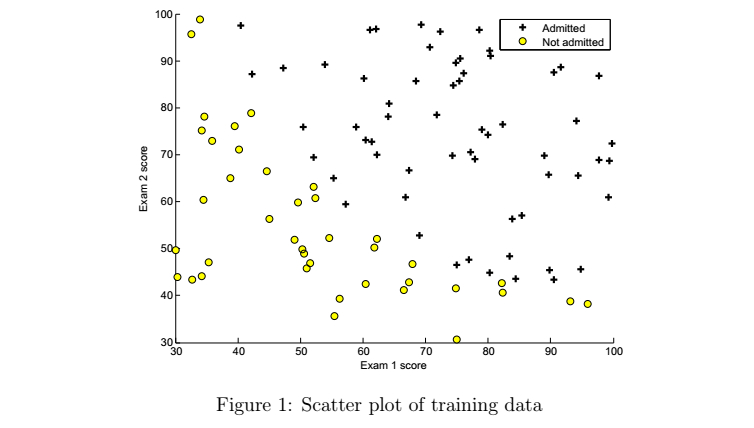
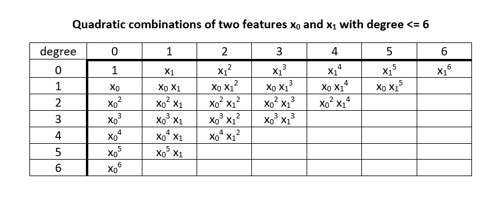

# 1 ML Ex 2 R implementationa: Logistic Regression

## 1.1 Introduction

In this exercise, you will implement logistic regression and apply it to two different datasets. In this part of the exercise, you will build a logistic regression model to predict whether a student gets admitted into a university. Suppose that you are the administrator of a university department and you want to determine each applicant’s chance of admission based on their results on two exams. You have historical data from previous applicants that you can use as a training set for logistic regression. For each training example, you have the applicant’s scores on two exams and the admissions decision.

Your task is to build a classification model that estimates an applicant’s probability of admission based the scores from those two exams. This outline and the framework code in ex2.m will guide you through the exercise.

### Data Prep

Because this particular implementation is performed through R. the base code that is provided in ex2.m will not execute. Hence, the data will first have to be loaded. 

```{r warning=FALSE}
library(readr)
ex2data1 <- read_csv("ex2data1.txt", 
                     col_names =  c("examScore1", "examScore2", "admission"),
                     col_types = cols(admission = col_factor(levels = c("0", "1"))))

X  <- as.matrix(ex2data1[,1:2])
y <- as.numeric(as.matrix(ex2data1[,3]))
```


### Visualizing the data
Before starting to implement any learning algorithm, it is always good to visualize the data if possible. In the first part of ex2.m, the code will load the data and display it on a 2-dimensional plot by calling the function plotData. You will now complete the code in plotData so that it displays a figure like Figure 1, where the axes are the two exam scores, and the positive and negative examples are shown with different markers.



To help you get more familiar with plotting, we have left plotData.m empty so you can try to implement it yourself. However, this is an optional (ungraded) exercise. We also provide our implementation below so you can copy it or refer to it. If you choose to copy our example, make sure you learn what each of its commands is doing by consulting the Octave/MATLAB documentation.


```{r warning=FALSE, message=FALSE, fig.height= 5}
#par(mar=c(4.1, 5.1, 1.1, 8.1), xpd=TRUE)

# Plot both groups
pch.list <- rep(0, 2)
pch.list[ex2data1$admission == 0] <- 21
pch.list[ex2data1$admission == 1] <- 43

plot(examScore2 ~ examScore1, ex2data1, ylim=range(c(30, 100)), xlim=range(c(30, 100)), 
     col = c(1,1), pch = c(pch.list),bg= "yellow")

# Add legend to top right, outside plot region
legend("topright", inset=c(0,-0.0375), legend=c("Not admitted","Admitted"), col = c("yellow",1), pch=c(19, 43))
```

### Warmup exercise: sigmoid function

Before you start with the actual cost function, recall that the logistic regression hypothesis is defined as:
$h_θ(x) = g(θ^T x)$;

where function g is the sigmoid function. The sigmoid function is defined as:

$g(z) = \frac{1}{1 + e^{−z}}$


Your first step is to implement this function in sigmoid.m so it can be called by the rest of your program. When you are finished, try testing a few values by calling sigmoid(x) at the Octave/MATLAB command line. For large positive values of x, the sigmoid should be close to 1, while for large negative values, the sigmoid should be close to 0. Evaluating sigmoid(0) should give you exactly 0.5. Your code should also work with vectors and matrices. **For a matrix, your function should perform the sigmoid function on every element.**

You can submit your solution for grading by typing submit at the Octave/MATLAB command line. The submission script will prompt you for your login e-mail and submission token and ask you which files you want to submit. You can obtain a submission token from the web page for the assignment.

You should now submit your solutions.
        

```{r warning=FALSE}
# Set up a sigmoid function and test it.

sigmoid <- function(x){
        1 / (1 + exp(-x))
        }
sigmoid(Inf)
sigmoid(-Inf)
sigmoid(0)

a <- matrix(c(-Inf, Inf, 0, 1), nrow = 2, ncol = 2)

a

sigmoid(a)
```

## 1.2 Cost function and gradient

Now you will implement the cost function and gradient for logistic regression. Complete the code in costFunction.m to return the cost and gradient.

Recall that the cost function in logistic regression is

$J(\theta) = \frac{1}{m} \sum_{i=1}^m \large[ -y^{(i)}\ \log (h_\theta (x^{(i)})) - (1 - y^{(i)})\ \log (1 - h_\theta(x^{(i)})) \large]$

A vectorized implementation is:

<span style="color:red">
\begin{align} & h = g(X\theta)\newline & J(\theta) = \frac{1}{m} \cdot \left(-y^{T}\log(h)-(1-y)^{T}\log(1-h)\right) \end{align}
</span>


and the gradient of the cost is a vector of the same length as $\theta$ where the $j^{th}$ element $(for j = 0, 1, ....,n)$ is defined as follows:


Remember that the general form of gradient descent is:

\begin{align}& Repeat \; \lbrace \newline & \; \theta_j := \theta_j - \alpha \dfrac{\partial}{\partial \theta_j}J(\theta) \newline & \rbrace\end{align}

We can work out the derivative part using calculus to get:

\begin{align} & Repeat \; \lbrace \newline & \; \theta_j := \theta_j - \frac{\alpha}{m} \sum_{i=1}^m (h_\theta(x^{(i)}) - y^{(i)}) x_j^{(i)} \newline & \rbrace \end{align}

Notice that this algorithm is identical to the one we used in linear regression. We still have to simultaneously update all values in theta.

A vectorized implementation is:

<span style="color: red">
$\theta := \theta - \frac{\alpha}{m} X^{T} (g(X \theta ) - \vec{y})$
</span>

The vectorized version;

$\nabla J(\theta) = \frac{1}{m} \cdot X^T \cdot \left(g\left(X\cdot\theta\right) - \vec{y}\right)$

Note that while this gradient looks identical to the linear regression gradient, the formula is actually different because linear and logistic regression have different definitions of $h_θ(x)$.

Once you are done, ex2.m will call your costFunction using the initial parameters of θ. You should see that the cost is about 0.693. You should now submit your solutions.

```{r warning=FALSE, message=FALSE}
# 4. Add intercept vector to the X matrix and set m(obs) and n(predictors)

X <- cbind(ones = rep(1,dim(X)[1]), X)
m <- dim(X)[1]
n <- dim(X)[2]


# 5. Set initial theta's 

initialTheta <-  matrix(rep(0, n), n, 1)


# 6. Make the cost function
#       - Input (Initial theta, X, y)
#       - Output (Cost and gradient)


costFunction <- function(theta, X, y){
        cost <-  1/m * ((t(-y)%*%log(sigmoid(X%*%theta))-
                        t((1-y))%*%log(1- sigmoid(X%*%theta))))
        
        grad <-  1/m * (t(sigmoid(X %*% theta) - y)%*%X)
        return(list(cost = cost, grad = grad))
}


# Expected gradients with initial theta (-0.1, -12.0092, -11.2628)
costFunction(initialTheta, X, y)
```


```{r warning=FALSE, message=FALSE}
# With test theta - expected cost 0.218, grad: (0.043, 2.566, 2.647)
costFunction(c(-24, 0.2, 0.2), X, y)
```


<span style="color: red">
Fully vectorized cost and grad functions :D
</span>

## 1.3 Learning parameters using fminunc

In the previous assignment, you found the optimal parameters of a linear regression model by implementing gradent descent. You wrote a cost function and calculated its gradient, then took a gradient descent step accordingly. This time, instead of taking gradient descent steps, you will use an Octave/-MATLAB built-in function called fminunc.

Octave/MATLAB’s fminunc is an optimization solver that finds the minimum of an unconstrained function. For logistic regression, you want to optimize the cost function J(θ) with parameters θ.

Concretely, you are going to use fminunc to find the best parameters θ for the logistic regression cost function, given a fixed dataset (of X and y values). You will pass to fminunc the following inputs:
        - The initial values of the parameters we are trying to optimize.
        - A function that, when given the training set and a particular θ, computes the logistic regression cost and gradient with respect to θ for the dataset (X, y)
        
In ex2.m, we already have code written to call fminunc with the correct arguments.

In this code snippet, we first defined the options to be used with fminunc. Specifically, we set the GradObj option to on, which tells fminunc that our function returns both the cost and the gradient. This allows fminunc to use the gradient when minimizing the function. Furthermore, we set the MaxIter option to 400, so that fminunc will run for at most 400 steps before it terminates.

To specify the actual function we are minimizing, we use a "short-hand" for specifying functions with the @(t) ( costFunction(t, X, y) ) . This creates a function, with argument t, which calls your costFunction. This allows us to wrap the costFunction for use with fminunc. 

If you have completed the costFunction correctly, fminunc will converge on the right optimization parameters and return the final values of the cost and θ. Notice that by using fminunc, you did not have to write any loops yourself, or set a learning rate like you did for gradient descent. This is all done by fminunc: you only needed to provide a function calculating the cost and the gradient.

Once fminunc completes, ex2.m will call your costFunction function using the optimal parameters of θ. You should see that the cost is about 0.203.

This final θ value will then be used to plot the decision boundary on the training data, resulting in a figure similar to Figure 2. We also encourage you to look at the code in plotDecisionBoundary.m to see how to plot such a boundary using the θ values.

```{r warning=FALSE, message=FALSE}

# 8. Find an implementation of advanced gradient descent algortihm fminunc

objCost <-  function (theta){
                1/m * (sum
                       (-y*log(sigmoid(X%*%theta))-
                                       (1-y)*log(1- sigmoid(X%*%theta)))
                )
        }
        
grad <-  function(theta) {
                1/m * (t(sigmoid(X %*% theta) - y)%*%X)
        }

library(ucminf)

# 9. Set options for fminunc and optimize with initial theta's

# The only arguments that objective and gradient functions that are passed to the 
# advanced algorithm can take is the parameters to be optimized - i.e. theta

# You can read more about the specific method.

# Expected cost : 0.203 - Expected gredients: -25.161, 0.206, 0.201

ucminf::ucminf(par = initialTheta, fn = objCost, gr = grad, control = list(trace = 0))

#optim(par = initialTheta, fn = objCost, gr = grad, method = "Nelder-Mead", control = list(trace = 0, maxIte = 400))
#optim(par = c(-24, 0.2, 0.2), fn = objCost, gr = grad, method = "Nelder-Mead", control = list(trace = 0, maxIte = 400))
# It actually converges to the same thing irrespective of the theta, and whether you have provided gradient function or not.
```


This final θ value will then be used to plot the decision boundary on the training data, resulting in a figure similar to Figure 2. We also encourage you to look at the code in plotDecisionBoundary.m to see how to plot such a boundary using the θ values.


## 1.4 Plot the decision boundary

For logistic regression, h = sigmoid(X * theta). This describes the relationship between X, theta, and h. We know theta (from gradient descent). We are given X. So we can compute 'h'. Now, by definition, the decision boundary is the locus of points where h = 0.5, or equivalently (X * theta) = 0, since the sigmoid(0) is 0.5.

Now we can write out the equation for the case where we have two features and a bias unit, and we write X as $[x_0 x_1 x_2x]$ and theta as $[\theta_0 \theta_1 \theta_2]$


$0 = x_0 \theta_0 + x_1 \theta_1 + x_2 \theta_2$

$x_0$ is the bias unit, it is hard-coded to 1.

$0 = \theta_0 + x_1 \theta_1 + x_2 \theta_2$

Solve for $x_2$
 
$x_2 = -(\theta_0 + x_1 \theta_1) / \theta_2$

Now, to draw a line, you need two points. So pick two values for $x_1$ - anything near the minimum and maximum of the training set will serve. Compute the corresponding values for $x_2$, and plot the $(x_1 x_2)$) pairs on the horizontal and vertical axes, then draw a line through them.

This line represents the decision boundary.

This is exactly what the plotDecisionBoundary() function does. $x_2$ is the variable "plot_y", and $x_1$ is the variable "plot_x".

"plot_x" also adds some factors of -2 and +2 to the min and max values. This is just to visually center the plot with some margin around the edges.


** In R you need the intercept and slop of this line rather than picking any point. i.e. **

$x_2 = -\frac{\theta_0 }{\theta_2} - \frac{\theta_1}{\theta_2}x_1$


```{r warning=FALSE, message=FALSE}

finalTheta <- ucminf::ucminf(par = initialTheta, fn = objCost, gr = grad, control = list(trace = 0))$par

pch.list <- rep(0, 2)
pch.list[ex2data1$admission == 0] <- 21
pch.list[ex2data1$admission == 1] <- 43

plot(examScore2 ~ examScore1, ex2data1, ylim=range(c(30, 100)), xlim=range(c(30, 100)), 
     col = c(1,1), pch = c(pch.list),bg= "yellow")

# Add legend to top right, outside plot region
legend("topright", inset=c(0,-0.0375), legend=c("Not admitted","Admitted", "Decision Boundary"), col = c("yellow",1, 3), pch=c(19, 43, 95))
abline(a = -finalTheta[1]/finalTheta[3], b = -finalTheta[2]/finalTheta[3], col = "green")
```


## 1.5 Evaluating logistic regression

After learning the parameters, you can use the model to predict whether a particular student will be admitted. For a student with an Exam 1 score of 45 and an Exam 2 score of 85, you should expect to see an admission
probability of 0.776.

Another way to evaluate the quality of the parameters we have found is to see how well the learned model predicts on our training set. In this part, your task is to complete the code in predict.m. The predict function will produce "1" or "0" predictions given a dataset and a learned parameter vector θ.


```{r}
parameters <- ucminf::ucminf(par = initialTheta, fn = objCost, gr = grad, control = list(trace = 0))$par
prediction <- function(theta,x1, x2){
        sigmoid(theta[1]+ theta[2]*x1 + theta[3]*x2)
}

# Use your new thetas to predict - score 45 and 85 respectively. 
prediction(parameters, 45, 85)
```

After you have completed the code in predict.m, the ex2.m script will proceed to report the training accuracy of your classifier by computing the percentage of examples it got correct.

```{r}
p <- prediction(parameters,X[,2], X[,3])

accuracy <- mean(round(p) == y)*100
accuracy
```

# 2 Regularized logistic regression

In this part of the exercise, you will implement regularized logistic regression to predict whether microchips from a fabrication plant passes quality assurance (QA). During QA, each microchip goes through various tests to ensure
it is functioning correctly.

Suppose you are the product manager of the factory and you have the test results for some microchips on two different tests. From these two tests, you would like to determine whether the microchips should be accepted or rejected. To help you make the decision, you have a dataset of test results on past microchips, from which you can build a logistic regression model.

```{r warning=FALSE, message=FALSE}
library(readr)
ex2data2 <- read_csv("ex2data2.txt", 
    col_names = c("microChip1", "microChip2", "qualityAssurance"),
    col_types = cols(`1` = col_factor(levels = c("0", 
        "1"))))
X  <- as.matrix(ex2data2[,1:2])
y <- as.numeric(as.matrix(ex2data2[,3]))
X <- cbind(ones = rep(1,dim(X)[1]), X)
m <- dim(X)[1]
n <- dim(X)[2]
```


## 2.1 Visualizing the data

Similar to the previous parts of this exercise, plotData is used to generate a figure like Figure 3, where the axes are the two test scores, and the positive (y = 1, accepted) and negative (y = 0, rejected) examples are shown with different markers.

```{r fig.height=7}
#par(mar=c(4.1, 5.1, 1.1, 5.1), xpd=TRUE)

# Plot both groups
pch.list <- rep(0, 2)
pch.list[ex2data2$qualityAssurance == 0] <- 21
pch.list[ex2data2$qualityAssurance == 1] <- 43

plot(microChip2 ~ microChip1, ex2data2, ylim=range(c(X[,3], X[,3])), xlim=range(c(X[,2], X[,2])), 
     col = c(1,1), pch = c(pch.list),bg= "yellow", axes = FALSE)

# set axis 

axis(side=1, at=seq(-1, 1.5, by = 0.5 ))
axis(side=2, at=seq(-0.8, 1.2, by=0.2))

# Add legend to top right, outside plot region
legend("topright", inset=c(0,0), legend=c("y = 0","y = 1"), col = c("yellow",1), pch=c(19, 43))
```

The figure above shows that our dataset cannot be separated into positive and negative examples by a straight-line through the plot. Therefore, a straightforward application of logistic regression will not perform well on this dataset since logistic regression will only be able to find a linear decision boundary.

## 2.2 Feature mapping

One way to fit the data better is to create more features from each data point. In the provided function mapFeature.m, we will map the features into all polynomial terms of x1 and x2 up to the sixth power.

$\begin{bmatrix} 1 \newline x_1 \newline x_2 \newline x_1^{2} \newline x_1 x_2 \newline x_2^{2} \newline x_1^{3}  \newline . \newline . \newline . \newline x_1 x_2^{5} \newline x_2^{6} \end{bmatrix}$

As a result of this mapping, our vector of two features (the scores on two QA tests) has been transformed into a 28-dimensional vector. A logistic regression classifier trained on this higher-dimension feature vector will have a more complex decision boundary and will appear nonlinear when drawn in our 2-dimensional plot.

While the feature mapping allows us to build a more expressive classifier, it also more susceptible to overfitting. In the next parts of the exercise, you will implement regularized logistic regression to fit the data and also see for yourself how regularization can help combat the overfitting problem.


```{r}
#  MAPFEATURE Feature mapping function to polynomial features - dope
# 
#    MAPFEATURE(X1, X2) maps the two input features
#    to quadratic features used in the regularization exercise.
# 
#    Returns a new feature array with more features, comprising of 
#    X1, X2, X1.^2, X2.^2, X1*X2, X1*X2.^2, etc..
# 
#    Inputs X1, X2 must be the same size

mapFeature <- function(X1, X2){
        
        degree <- 6
        
        out <- as.matrix(rep(1, length(X1)))
        
        for (i in 1:degree) {
                for (j in 0:i) {
                        #browser() - was used to debug your function
                        out <- cbind(out, (X1^(i-j))*(X2^j))
                }
        }
        return(out)  
}

# This is very very close to the octave file but not exact. Come back to it if you have different thetas.
X <- mapFeature(X[,2], X[,3])
```


The map feature does what is shown in the following figure. 



## 2.3 Cost function and gradient

Now you will implement code to compute the cost function and gradient for regularized logistic regression. Complete the code in costFunctionReg.m to return the cost and gradient.

Recall that the regularized cost function in logistic regression is

$J(\theta) = - \frac{1}{m} \sum_{i=1}^m \large[ y^{(i)}\ \log (h_\theta (x^{(i)})) + (1 - y^{(i)})\ \log (1 - h_\theta(x^{(i)}))\large] + \frac{\lambda}{2m}\sum_{j=1}^n \theta_j^2$


Note that you should not regularize the parameter $\theta_0$. In Octave/MATLAB, recall that indexing starts from 1, hence, you should not be regularizing the theta(1) parameter (which corresponds to $\theta_0$) in the code. The gradient of the cost function is a vector where the $j^{th}$ element is defined as follows:

\begin{align} & \text{Repeat}\ \lbrace \newline & \ \ \ \ \theta_0 := \theta_0 - \alpha\ \frac{1}{m}\ \sum_{i=1}^m (h_\theta(x^{(i)}) - y^{(i)})x_0^{(i)} \newline & \ \ \ \ \theta_j := \theta_j - \alpha\ \left[ \left( \frac{1}{m}\ \sum_{i=1}^m (h_\theta(x^{(i)}) - y^{(i)})x_j^{(i)} \right) + \frac{\lambda}{m}\theta_j \right] &\ \ \ \ \ \ \ \ \ \ j \in \lbrace 1,2...n\rbrace\newline & \rbrace \end{align}

```{r}
# Regularized cost and gradient 

m <- dim(X)[1]
n <- dim(X)[2]

# 5. Set initial theta's 

initialTheta <-  matrix(rep(0, n), n, 1)


# 6. Make the cost function
#       - Input (Initial theta, X, y, lambda)
#       - Output (Cost and gradient)

# Important to regularize the first parameter both in the grad and the cost.
# Main trick done here is to replace the sum function with a vector multiplication
# by creating a row vector of 1. Then to not regularize the first theta replace it with 0 
# and take theta values starting from the second to the end.

costFunctionReg <- function(theta, X, y, lambda){
        cost <-  1/m * ((t(-y)%*%log(sigmoid(X%*%theta))-
                        t((1-y))%*%log(1- sigmoid(X%*%theta)))) + 
          ( (lambda/(2*m)) * (rep(1, length(theta)) %*% (c(0, theta[2:length(theta)]))^2))
        
        grad <-  1/m * (t(sigmoid(X %*% theta) - y)%*%X) + ((lambda/m)*(c(0, theta[2:length(theta)])))
        return(list(cost = cost, grad = grad))
}


# Expected gradients with initial theta - actually from octave for accuracy (0.008475, 0.018788, 0.000078, 0.050345, 0.011501) - Expected cost - 0.693147
costFunctionReg(initialTheta, X, y, 1)
```

```{r}
testTheta <- matrix(rep(1, n), n, 1)
# expected cost - 3.164509 & expected thetas for the first 5 gradients (0.346045, 0.161352, 0.194796,  0.226863, 0.092186)
costFunctionReg(testTheta, X, y, 10)
```

## 2.4 Learning parameters using fminunc

Similar to the previous parts, you will use fminunc to learn the optimal parameters θ. If you have completed the cost and gradient for regularized logistic regression (costFunctionReg.m) correctly, you should be able to step through the next part of ex2 reg.m to learn the parameters θ using fminunc.

<span style="color:red">
Correction: objective and grad function that is passed to the fminunc call can take more than one variable. However, the variable to be optimized should be the first argument and specific value for the other variables should be passed to the advanced minimization algorithm after the objective and the gradient functions.
</span>

<span style="color:red">
There is also a small difference in the gradients the reason for which I did not understand at the moment.
</span>

```{r}
costReg <-  function(theta, X, y, lambda){
  1/m * ((t(-y)%*%log(sigmoid(X%*%theta))-
                        t((1-y))%*%log(1- sigmoid(X%*%theta)))) + 
          ( (lambda/(2*m)) * (rep(1, length(theta)) %*% (c(0, theta[2:length(theta)]))^2))
}
        
gradReg <-  function(theta, X, y, lambda){
  1/m * (t(sigmoid(X %*% theta) - y)%*%X) + ((lambda/m)*(c(0, theta[2:length(theta)])))
}


# Expected cost - J =  0.52900 and first 5 gradients  (1.273005, 0.624876, 1.177376, -2.020142, -0.912616)
regOptim <- ucminf::ucminf(par = initialTheta, fn = costReg, gr = gradReg,  X = X, y =y, lambda = 1, control = list(trace = 0, maxeval= 400))

regOptim[c(2,1)]
```


## 2.5 Plotting the decision boundary

To help you visualize the model learned by this classifier, we have provided the function plotDecisionBoundary.m which plots the (non-linear) decision boundary that separates the positive and negative examples. In plotDecisionBoundary.m, we plot the non-linear decision boundary by computing the classifier’s predictions on an evenly spaced grid and then and drew a contour plot of where the predictions change from y = 0 to y = 1. 

After learning the parameters θ, the next step in ex reg.m will plot a decision boundary similar to Figure 4.


```{r fig.height=8}
# # Plot both groups - X should include intercept
plotDecisionBoundary <- function(X, y, lambda=NULL, initialTheta){
  if (dim(X)[2]<= 3) {
    finalTheta <- ucminf::ucminf(par = initialTheta, fn = costReg, gr = gradReg,  X = X, y =y, lambda = lambda, control = list(trace = 0, maxeval= 400))$par

    pch.list <- rep(0, 2)
    pch.list[ex2data1$admission == 0] <- 21
    pch.list[ex2data1$admission == 1] <- 43
    

    plot(examScore2 ~ examScore1, ex2data1, ylim=range(c(30, 100)), xlim=range(c(30, 100)), 
       col = c(1,1), pch = c(pch.list), bg = "yellow")

    # Add legend to top right, outside plot region
    legend("topright", inset=c(0,-0.0375), legend=c("Not admitted","Admitted", "Decision Boundary"), col = c("yellow",1,3), pch=c(19, 43, 95))
    abline(a = -finalTheta[1]/finalTheta[3], b = -finalTheta[2]/finalTheta[3], col = "green")
  } else {
    regOptim <- ucminf::ucminf(par = initialTheta, fn = costReg, gr = gradReg,  X = X, y =y, lambda = lambda, control = list(trace = 0, maxeval= 400))
    
    u <-  seq(-1, 1.5, length = 50)
    v <-  seq(-1, 1.5, length = 50)

    z <- matrix(0,length(u), length(v))

    for (i in 1:length(u)) {
        for (j in 1:length(v)) {
                z[i,j] <- mapFeature(u[i],v[j])%*%regOptim$par
        }
    }
    pch.list <- rep(0, 2)
    pch.list[ex2data2$qualityAssurance == 0] <- 21
    pch.list[ex2data2$qualityAssurance == 1] <- 43


    plot(microChip2 ~ microChip1, ex2data2, ylim=range(c(X[,3], X[,3]+0.1)), xlim=range(c(X[,2], X[,2]+0.25)),
       col = c(1,1), pch = c(pch.list),bg= "yellow", axes = FALSE)
    axis(side=1, at=seq(-1, 1.5, by = 0.5 ))
    axis(side=2, at=seq(-0.8, 1.2, by=0.2))

    legend("topright", inset=c(0,0), legend=c("y = 0","y = 1", "decision boudnary"), col = c("yellow", 1, 3), pch=c(19, 43, 95))
    contour(x = u, y = v, z = z, c(0,0),lwd = 2, add = TRUE, col = "green")
  }
}

# This would be the previous plot --- reason why you should develop more general functions
# plotDecisionBoundary(X = cbind(ones = rep(1,dim(ex2data1)[1]),as.matrix(ex2data1[,1:2])), y = as.numeric(as.matrix(ex2data1[,3])), initialTheta = matrix(rep(0, 3), 3, 1), lambda = 0)

plotDecisionBoundary(X = X, y = y, lambda = 1, initialTheta = initialTheta)
```

## 2.4 Varying lambda levels


In this part of the exercise, you will get to try out different regularization parameters for the dataset to understand how regularization prevents overfitting. 

Notice the changes in the decision boundary as you vary λ. With a small λ, you should find that the classifier gets almost every training example correct, but draws a very complicated boundary, thus overfitting the data (Figure 5). This is not a good decision boundary: for example, it predicts that a point at x = (−0.25, 1.5) is accepted (y = 1), which seems to be an
incorrect decision given the training set.

With a larger λ, you should see a plot that shows an simpler decision boundary which still separates the positives and negatives fairly well. However, if λ is set to too high a value, you will not get a good fit and the decision boundary will not follow the data so well, thus underfitting the data (Figure 6).


```{r echo=FALSE, eval=FALSE}
inputPanel(
  
  sliderInput("lambda", label = "Set lambda value:",
              min = 0, max = 176, value = 0, step = 1)
)
```


```{r eval=FALSE}
# The height setting was a bit annoying. So you have to set the plotOut height as auto and then create a function inside render plot to set it to a value you want.
renderPlot({
  plotOutput(plotDecisionBoundary(X = X, y = y, lambda = input$lambda, initialTheta = initialTheta), height = "auto")
}, height = function() {
      600
  })
```


