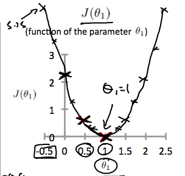
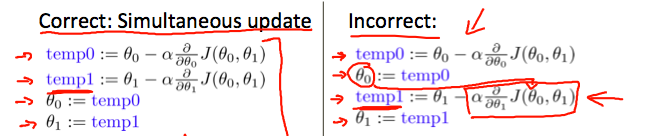
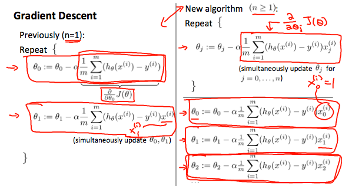

```{r setup, include=FALSE}
knitr::opts_chunk$set(echo = TRUE)

octaveExe<- Sys.getenv("octaveExe")
octaveExe
```

# Week 1

## What is Machine Learning?

Arthur Samuel described it as: **"the field of study that gives computers the ability to learn without being explicitly programmed."** 
This is an older, informal definition.

Modern: Tom Mitchell (1998) defines machine learning by saying that a well-posed learning problem is defined as follows. 

- **Well-posed Learning Problem: A computer program is said to learn from experience E with respect to some task T and some performance measure P, if its performance on T, as measured by P, improves with experience E.**

In the checkers example 

- E is the experience of playing the game 10,000's of times against itself. 
- T is the task of playing checkers
- P is probability of winning the next game of checkers. 


Two types of ML algorithms: 

- supervised learning
- unsupervised learning. 


Other types: reinforcement learning, recommended systems.


## Supervised Learning

- Regression problem: Where you are trying to fit a model to explain a continuous
variable by using a predictor. 

- Classification Problem: Where you are trying to fit a model to explain a 
bernoulli/binomial variable by using a predictor. - When you have multiple
predictors it makes sense to visualize it with the predictors and point label the
outcome variable. 


### Supervised Learning (note)
In supervised learning, we are given a data set and already know what our correct
output should look like, having the idea that there is a relationship between the
input and the output.

Supervised learning problems are categorized into "regression" and "classification" 
problems. In a regression problem, we are trying to predict results within a 
continuous output, meaning that we are trying to map input variables to some 
continuous function. 

In a classification problem, we are instead trying to predict results in a 
discrete output. In other words, we are trying to map input variables into 
discrete categories.

Example 1:

Given data about the size of houses on the real estate market, try to predict 
their price. Price as a function of size is a continuous output, so this is a 
regression problem.

We could turn this example into a classification problem by instead making our 
output about whether the house "sells for more or less than the asking price." 
Here we are classifying the houses based on price into two discrete categories.

Example 2:

(a) Regression - Given a picture of a person, we have to predict their age on the
basis of the given picture

(b) Classification - Given a patient with a tumor, we have to predict whether the
tumor is malignant or benign.

## Unsupervised Learning

Unsupervised learning allows us to approach problems with little or no idea what 
our results should look like. We can derive structure from data where we don't 
necessarily know the effect of the variables.

We can derive this structure by clustering the data based on relationships among 
the variables in the data.

With unsupervised learning there is no feedback based on the prediction results.

Example:

Clustering: Take a collection of 1,000,000 different genes, and find a way to 
automatically group these genes into groups that are somehow similar or related 
by different variables, such as lifespan, location, roles, and so on.

Non-clustering: The "Cocktail Party Algorithm", allows you to find structure in 
a chaotic environment. (i.e. identifying individual voices and music from a mesh 
of sounds at a cocktail party).


## Model Representation


To establish notation for future use, we’ll use $x^{i}$ to denote the “input” 
variables (living area in this example), also called input features, and $y^{i}$
to denote the “output” or target variable that we are trying to predict (price). 
A pair ($x^{i}$ , $y^{i}$) is called a training example, and the dataset that 
we’ll be using to learn—a list of m training examples {($x^{(i)}$ , $y^{(i)}$ ); 
i = 1, . . . , m—is called a training set. Note that the superscript “(i)” in the 
notation is simply an index into the training set, and has nothing to do with 
exponentiation. We will also use X to denote the space of input values, and Y to 
denote the space of output values. In this example, X = Y = ℝ.

To describe the supervised learning problem slightly more formally, our goal is, 
given a training set, to learn a function h : X → Y so that h(x) is a “good” 
predictor for the corresponding value of y. For historical reasons, this function 
h is called a hypothesis. Seen pictorially, the process is therefore like this:


When the target variable that we’re trying to predict is continuous, such as in 
our housing example, we call the learning problem a regression problem. When y 
can take on only a small number of discrete values (such as if, given the living 
area, we wanted to predict if a dwelling is a house or an apartment, say), we 
call it a classification problem.


## Cost Function

We can measure the accuracy of our hypothesis function by using a cost function. 
This takes an average difference (actually a fancier version of an average) of 
all the results of the hypothesis with inputs from x's and the actual output y's.

$J(\theta_0, \theta_1) = \dfrac {1}{2m} \displaystyle \sum _{i=1}^m \left ( \hat{y}_{i}- y_{i} \right)^2 = \dfrac {1}{2m} \displaystyle \sum _{i=1}^m \left (h_\theta (x_{i}) - y_{i} \right)^2$

To break it apart, it is $\frac{1}{2} \bar{x}$ where $\bar{x}$ is the mean of the 
squares of $h_\theta (x_{i}) - y_{i}$, or the difference between the predicted 
value and the actual value.

This function is otherwise called the **"Squared error function"**, or **"Mean squared error"**. The mean is halved $\left(\frac{1}{2}\right)$ as a convenience for the 
computation of the gradient descent, as the derivative term of the square function
will cancel out the $\frac{1}{2}$ term. 

The following image summarizes what the cost function does:


## Cost Function - Intution I

If we try to think of it in visual terms, our training data set is scattered on the x-y plane. We are trying to make a straight line (defined by $h_\theta(x)$) which passes through these scattered data points.

Our objective is to get the best possible line. The best possible line will be such so that the average squared vertical distances of the scattered points from the line will be the least. Ideally, the line should pass through all the points of our training data set. In such a case, the value of $J(\theta_0, \theta_1)$ will be 0. The following example shows the ideal situation where we have a cost function of 0.


When $\theta_1 = 1$, we get a slope of 1 which goes through every single data point in our model. Conversely, when $\theta_1 = 0.5$, we see the vertical distance from our fit to the data points increase.


This increases our cost function to 0.58. Plotting several other points yields to the following graph:



Thus as a goal, we should try to minimize the cost function. In this case, $\theta_1 = 1$ is our global minimum.

## Cost Function - Intution II

A contour plot is a graph that contains many contour lines. A contour line of a two variable function has a constant value at all points of the same line. An example of such a graph is the one to the right below.


Taking any color and going along the 'circle', one would expect to get the same value of the cost function. For example, the three green points found on the green line above have the same value for $J(\theta_0,\theta_1)$ and as a result, they are found along the same line. The circled x displays the value of the cost function for the graph on the left when $\theta_0 = 800$ and $\theta_1 = -0.15$. Taking another h(x) and plotting its contour plot, one gets the following graphs:


When $\theta_0 = 360$ and $\theta_1 = 0$, the value of $J(\theta_0,\theta_1)$ in the contour plot gets closer to the center thus reducing the cost function error. Now giving our hypothesis function a slightly positive slope results in a better fit of the data.


The graph above minimizes the cost function as much as possible and consequently, the result of $\theta_1$ and $\theta_0$ tend to be around 0.12 and 250 respectively. Plotting those values on our graph to the right seems to put our point in the center of the inner most 'circle'.

## Gradient Descent

So we have our hypothesis function and we have a way of measuring how well it fits into the data. Now we need to estimate the parameters in the hypothesis function. That's where gradient descent comes in.

Imagine that we graph our hypothesis function based on its fields $\theta_0$ and $\theta_1$ (actually we are graphing the cost function as a function of the parameter estimates). We are not graphing x and y itself, but the parameter range of our hypothesis function and the cost resulting from selecting a particular set of parameters.

We put $\theta_0$ on the x axis and $\theta_1$ on the y axis, with the cost function on the vertical z axis. The points on our graph will be the result of the cost function using our hypothesis with those specific theta parameters. The graph below depicts such a setup.


We will know that we have succeeded when our cost function is at the very bottom of the pits in our graph, i.e. when its value is the minimum. The red arrows show the minimum points in the graph.

The way we do this is by taking the derivative (the tangential line to a function) of our cost function. The slope of the tangent is the derivative at that point and it will give us a direction to move towards. We make steps down the cost function in the direction with the steepest descent. The size of each step is determined by the parameter α, which is called the learning rate.

For example, the distance between each 'star' in the graph above represents a step determined by our parameter α. A smaller α would result in a smaller step and a larger α results in a larger step. The direction in which the step is taken is determined by the partial derivative of $J(\theta_0,\theta_1)$. Depending on where one starts on the graph, one could end up at different points. The image above shows us two different starting points that end up in two different places.

The gradient descent algorithm is:

repeat until convergence:

$\theta_j := \theta_j - \alpha \frac{\partial}{\partial \theta_j} J(\theta_0, \theta_1)$

where

j=0,1 represents the feature index number. (In Econometrics this is just the $\beta_0$ and $\beta_1$ here intercept and the slop for the first explanatory variable)

At each iteration j, one should simultaneously update the parameters $\theta_1, \theta_2,...,\theta_n$. Updating a specific parameter prior to calculating another one on the $j^{(th)}$ iteration would yield to a wrong implementation.




## Gradient Descent Intution

In this video we explored the scenario where we used one parameter $\theta_1$ and plotted its cost function to implement a gradient descent. Our formula for a single parameter was :

Repeat until convergence:

$\theta_1:=\theta_1-\alpha \frac{d}{d\theta_1} J(\theta_1)$

Regardless of the slope's sign for $\frac{d}{d\theta_1} J(\theta_1)$, $\theta_1$ eventually converges to its minimum value. The following graph shows that when the slope is negative, the value of $\theta_1$ increases and when it is positive, the value of $\theta_1$ decreases.


On a side note, we should adjust our parameter $\alpha$ to ensure that the gradient descent algorithm converges in a reasonable time. Failure to converge or too much time to obtain the minimum value imply that our step size is wrong.


How does gradient descent converge with a fixed step size $\alpha$?
The intuition behind the convergence is that $\frac{d}{d\theta_1} J(\theta_1)$ approaches 0 as we approach the bottom of our convex function. At the minimum, the derivative will always be 0 and thus we get:

$\theta_1:=\theta_1-\alpha * 0$


## Gradient Descent for Linear Regression


When specifically applied to the case of linear regression, a new form of the gradient descent equation can be derived. We can substitute our actual cost function and our actual hypothesis function and modify the equation to :

$\begin{align*} \text{repeat until convergence: } \lbrace & \newline \theta_0 := & \theta_0 - \alpha \frac{1}{m} \sum\limits_{i=1}^{m}(h_\theta(x_{i}) - y_{i}) \newline \theta_1 := & \theta_1 - \alpha \frac{1}{m} \sum\limits_{i=1}^{m}\left((h_\theta(x_{i}) - y_{i}) x_{i}\right) \newline \rbrace& \end{align*}$

where m is the size of the training set, $\theta_0$ a constant that will be changing simultaneously with $\theta_1$ and $x_{i}, y_{i}$ are values of the given training set (data).

Note that we have separated out the two cases for $\theta_j$ into separate equations for $\theta_0$ and $\theta_1$; and that for $\theta_1$ we are multiplying $x_{i}$ at the end due to the derivative.

The following is a derivation of $\frac {\partial}{\partial \theta_j}J(\theta)$ for a single example :


The point of all this is that if we start with a guess for our hypothesis and then repeatedly apply these gradient descent equations, our hypothesis will become more and more accurate.

So, this is simply gradient descent on the original cost function J. This method looks at every example in the entire training set on every step, and is called **batch gradient descent**. Note that, while gradient descent can be susceptible to local minima in general, the optimization problem we have posed here for linear regression has only one global, and no other local, optima; thus gradient descent always converges (assuming the learning rate α is not too large) to the global minimum. Indeed, J is a convex quadratic function. Here is an example of gradient descent as it is run to minimize a quadratic function.


The ellipses shown above are the contours of a quadratic function. Also shown is the trajectory taken by gradient descent, which was initialized at (48,30). The x’s in the figure (joined by straight lines) mark the successive values of θ that gradient descent went through as it converged to its minimum.


#### Additonal self note

<span style="color:red">
Actually, if you replace $\\h_\theta (x_i)$ with $\theta_0 + \theta_1*X_i$, in the cost function then you can derive the partial derivative yourself and you will get the same results. Plus the multivariate gradient descent should come as a normal extension of what is done here. Essentially, you are holding all explanatory variables constant then mapping the slope of one explanatory variable or the intercept against the cost function. Finding the slop and adjusting the value depending on this slope and  also doing all this simultaneously of course.
</span>


$J(\theta_0, \theta_1) = \dfrac {1}{2m} \displaystyle \sum _{i=1}^m \left ( \hat{y}_{i}- y_{i} \right)^2 = \dfrac {1}{2m} \displaystyle \sum _{i=1}^m \left (h_\theta (x_{i}) - y_{i} \right)^2$

$J(\theta_0, \theta_1) = \dfrac {1}{2m} \displaystyle \sum _{i=1}^m \left (h_\theta (x_{i}) - y_{i} \right)^2$

$J(\theta_0, \theta_1) = \dfrac {1}{2m} \displaystyle \sum _{i=1}^m \left ((\theta_0 + \theta_1*X_i) - y_{i} \right)^2$

<span style="color:red">i.e partial derivative of the last equation with respect to $\theta_0$ and $\theta_1$.</span>


## Matrices and Vectors

Matrices are 2-dimensional arrays:

$\begin{bmatrix} a & b & c \newline d & e & f \newline g & h & i \newline j & k & l\end{bmatrix}$

The above matrix has four rows and three columns, so it is a 4 x 3 matrix.

A vector is a matrix with one column and many rows:

$\begin{bmatrix} w \newline x \newline y \newline z \end{bmatrix}$

So vectors are a subset of matrices. The above vector is a 4 x 1 matrix.

Notation and terms:

- $A_{ij}$ refers to the element in the ith row and jth column of matrix A.
- A vector with 'n' rows is referred to as an 'n'-dimensional vector.
- $v_i$ refers to the element in the ith row of the vector.
- In general, all our vectors and matrices will be 1-indexed. Note that for some programming languages, the arrays are 0-indexed.
- Matrices are usually denoted by uppercase names while vectors are lowercase.
- "Scalar" means that an object is a single value, not a vector or matrix.
- $\mathbb{R}$ refers to the set of scalar real numbers.
- $\mathbb{R^n}$ refers to the set of n-dimensional vectors of real numbers.

Run the cell below to get familiar with the commands in Octave/Matlab. Feel free to create matrices and vectors and try out different things.


```{octave, engine.path=octaveExe}
% The ; denotes we are going back to a new row.
A = [1, 2, 3; 4, 5, 6; 7, 8, 9; 10, 11, 12]

% Initialize a vector 
v = [1;2;3] 

% Get the dimension of the matrix A where m = rows and n = columns
[m,n] = size(A)

% You could also store it this way
dim_A = size(A)

% Get the dimension of the vector v 
dim_v = size(v)

% Now let's index into the 2nd row 3rd column of matrix A
A_23 = A(2,3)
```

## Addition and Scalar Multiplication

Addition and subtraction are element-wise, so you simply add or subtract each corresponding element:

$\begin{bmatrix} a & b \newline c & d \newline \end{bmatrix} +\begin{bmatrix} w & x \newline y & z \newline \end{bmatrix} =\begin{bmatrix} a+w & b+x \newline c+y & d+z \newline \end{bmatrix}$

Subtracting Matrices:

$\begin{bmatrix} a & b \newline c & d \newline \end{bmatrix} - \begin{bmatrix} w & x \newline y & z \newline \end{bmatrix} =\begin{bmatrix} a-w & b-x \newline c-y & d-z \newline \end{bmatrix}$

To add or subtract two matrices, their dimensions must be the same.

In scalar multiplication, we simply multiply every element by the scalar value:

$\begin{bmatrix} a & b \newline c & d \newline \end{bmatrix} * x =\begin{bmatrix} a*x & b*x \newline c*x & d*x \newline \end{bmatrix}$

In scalar division, we simply divide every element by the scalar value:

$\begin{bmatrix} a & b \newline c & d \newline \end{bmatrix} / x =\begin{bmatrix} a /x & b/x \newline c /x & d /x \newline \end{bmatrix}$

Experiment below with the Octave/Matlab commands for matrix addition and scalar multiplication. Feel free to try out different commands. Try to write out your answers for each command before running the cell below.

```{octave, engine.path=octaveExe}

% Initialize matrix A and B 
A = [1, 2, 4; 5, 3, 2]
B = [1, 3, 4; 1, 1, 1]

% Initialize constant s 
s = 2

% See how element-wise addition works
add_AB = A + B 

% See how element-wise subtraction works
sub_AB = A - B

% See how scalar multiplication works
mult_As = A * s

% Divide A by s
div_As = A / s

% What happens if we have a Matrix + scalar?
add_As = A + s

```

## Matrix-Vector Multiplication


We map the column of the vector onto each row of the matrix, multiplying each element and summing the result.

$\begin{bmatrix} a & b \newline c & d \newline e & f \end{bmatrix} *\begin{bmatrix} x \newline y \newline \end{bmatrix} =\begin{bmatrix} a*x + b*y \newline c*x + d*y \newline e*x + f*y\end{bmatrix}$

The result is a **vector**. The number of **columns** of the matrix must equal the number of **rows** of the vector.

An **m x n matrix** multiplied by an **n x 1** vector results in an **m x 1 vector**.

Below is an example of a matrix-vector multiplication. Make sure you understand how the multiplication works. Feel free to try different matrix-vector multiplications.

```{octave, engine.path = octaveExe}

% Initialize matrix A 
A = [1, 2, 3; 4, 5, 6;7, 8, 9] 

% Initialize vector v 
v = [1; 1; 1] 

% Multiply A * v
Av = A * v

```

## Matrix-Matrix Multiplication

We multiply two matrices by breaking it into several vector multiplications and concatenating the result.

$\begin{bmatrix} a & b \newline c & d \newline e & f \end{bmatrix} *\begin{bmatrix} w & x \newline y & z \newline \end{bmatrix} =\begin{bmatrix} a*w + b*y & a*x + b*z \newline c*w + d*y & c*x + d*z \newline e*w + f*y & e*x + f*z\end{bmatrix}$

An **m x n matrix** multiplied by an **n x o matrix** results in an **m x o** matrix. In the above example, a 3 x 2 matrix times a 2 x 2 matrix resulted in a 3 x 2 matrix.


To multiply two matrices, the number of **columns** of the first matrix must equal the number of **rows** of the second matrix.

For example:

```{octave, engine.path = octaveExe}

% Initialize a 3 by 2 matrix 
A = [1, 2; 3, 4;5, 6]

% Initialize a 2 by 1 matrix 
B = [1; 2] 

% We expect a resulting matrix of (3 by 2)*(2 by 1) = (3 by 1) 
mult_AB = A*B

% Make sure you understand why we got that result

```


## Matrix Multiplication Properties

- Matrices are not commutative: $A∗B \neq B∗A$
- Matrices are associative: $(A∗B)∗C = A∗(B∗C)$

The **identity matrix**, when multiplied by any matrix of the same dimensions, results in the original matrix. It's just like multiplying numbers by 1. The identity matrix simply has 1's on the diagonal (upper left to lower right diagonal) and 0's elsewhere.

$\begin{bmatrix} 1 & 0 & 0 \newline 0 & 1 & 0 \newline 0 & 0 & 1 \newline \end{bmatrix}$ 

When multiplying the identity matrix after some matrix (A∗I), the square identity matrix's dimension should match the other matrix's **columns**. When multiplying the identity matrix before some other matrix (I∗A), the square identity matrix's dimension should match the other matrix's **rows**.


```{octave, engine.path = octaveExe}
% Initialize random matrices A and B 
A = [1,2;4,5]
B = [1,1;0,2]

% Initialize a 2 by 2 identity matrix
I = eye(2)

% The above notation is the same as I = [1,0;0,1]

% What happens when we multiply I*A ? 
IA = I*A 

% How about A*I ? 
AI = A*I 

% Compute A*B 
AB = A*B 

% Is it equal to B*A? 
BA = B*A 

% Note that IA = AI but AB != BA

```


## Inverse and Transpose


The **inverse** of a matrix A is denoted $A^{-1}$. Multiplying by the inverse results in the identity matrix.

A non square matrix does not have an inverse matrix. We can compute inverses of matrices in octave with the $pinv(A)$ function and in Matlab with the $inv(A)$ function. Matrices that don't have an inverse are **singular** or **degenerate**.

The **transposition** of a matrix is like rotating the matrix 90° in clockwise direction and then reversing it. We can compute transposition of matrices in matlab with the transpose(A) function or A':

$A = \begin{bmatrix} a & b \newline c & d \newline e & f \end{bmatrix}$

$A^T = \begin{bmatrix} a & c & e \newline b & d & f \newline \end{bmatrix}$

In other words:

$A_{ij} = A^T_{ji}$


```{octave, engine.path = octaveExe}
% Initialize matrix A 
A = [1,2,0;0,5,6;7,0,9]

% Transpose A 
A_trans = A' 

% Take the inverse of A 
A_inv = inv(A)


% What is A^(-1)*A? 
A_invA = inv(A)*A
```


## Multiple features

Linear regression with multiple variables is also known as "multivariate linear regression".

We now introduce notation for equations where we can have any number of input variables.

$\begin{align*}x_j^{(i)} &= \text{value of feature } j \text{ in the }i^{th}\text{ training example} \newline x^{(i)}& = \text{the input (features) of the }i^{th}\text{ training example} \newline m &= \text{the number of training examples} \newline n &= \text{the number of features} \end{align*}$

The multivariable form of the hypothesis function accommodating these multiple features is as follows:

$h_\theta (x) = \theta_0 + \theta_1 x_1 + \theta_2 x_2 + \theta_3 x_3 + \cdots + \theta_n x_n$
 

In order to develop intuition about this function, we can think about $\theta_0$ as the basic price of a house, $\theta_1$ as the price per square meter, $\theta_2$ as the price per floor, etc. $x_1$ will be the number of square meters in the house, $x_2$ the number of floors, etc.


Using the definition of matrix multiplication, our multivariable hypothesis function can be concisely represented as:

$\begin{align*}h_\theta(x) =\begin{bmatrix}\theta_0 \hspace{2em} \theta_1 \hspace{2em} ... \hspace{2em} \theta_n\end{bmatrix}\begin{bmatrix}x_0 \newline x_1 \newline \vdots \newline x_n\end{bmatrix}= \theta^T x\end{align*}$


This is a vectorization of our hypothesis function for one training example; see the lessons on vectorization to learn more.


Remark: Note that for convenience reasons in this course we assume $x_{0}^{(i)} =1 \text{ for } (i\in { 1,\dots, m } )$. This allows us to do matrix operations with theta and x. Hence making the two vectors $'\theta'$ and $x^{(i)}$ match each other element-wise (that is, have the same number of elements: n+1).


## Gradient Descent for Multiple Variables

The gradient descent equation itself is generally the same form; we just have to repeat it for our 'n' features:

$\begin{align*} & \text{repeat until convergence:} \; \lbrace \newline \; & \theta_0 := \theta_0 - \alpha \frac{1}{m} \sum\limits_{i=1}^{m} (h_\theta(x^{(i)}) - y^{(i)}) \cdot x_0^{(i)}\newline \; & \theta_1 := \theta_1 - \alpha \frac{1}{m} \sum\limits_{i=1}^{m} (h_\theta(x^{(i)}) - y^{(i)}) \cdot x_1^{(i)} \newline \; & \theta_2 := \theta_2 - \alpha \frac{1}{m} \sum\limits_{i=1}^{m} (h_\theta(x^{(i)}) - y^{(i)}) \cdot x_2^{(i)} \newline & \cdots \newline \rbrace \end{align*}$

In other words:

$\begin{align*}& \text{repeat until convergence:} \; \lbrace \newline \; & \theta_j := \theta_j - \alpha \frac{1}{m} \sum\limits_{i=1}^{m} (h_\theta(x^{(i)}) - y^{(i)}) \cdot x_j^{(i)} \; & \text{for j := 0...n}\newline \rbrace\end{align*}$

The following image compares gradient descent with one variable to gradient descent with multiple variables:




#### Additonal self note

<span style="color:red">
Refer back to your self note on the one feature gradient descent. Essentially, a more general partial derivative of the cost function is provided here. But the idea of mapping a a feature against the cost function, holding all other features constant, and then adjusting the slop to minimize the cost function applies. 
Again if you replace $h_\theta$ in the cost function with $\theta_0 + \theta_1*x^1 + ... + \theta_n*x^n$ and do the partial derivative of the cost function with respect to each $\theta$ then you will get the same term as shown above. 
</span>


## Gradient Descent in Practice I - Feature Scaling

We can speed up gradient descent by having each of our input values in roughly the same range. This is because θ will descend quickly on small ranges and slowly on large ranges, and so will oscillate inefficiently down to the optimum when the variables are very uneven.

The way to prevent this is to modify the ranges of our input variables so that they are all roughly the same. Ideally:

$−1 ≤ x_{(i)} ≤ 1$

or

$−0.5 ≤ x_{(i)} ≤ 0.5$

These aren't exact requirements; we are only trying to speed things up. The goal is to get all input variables into roughly one of these ranges, give or take a few.

Two techniques to help with this are feature scaling and mean normalization. Feature scaling involves dividing the input values by the range (i.e. the maximum value minus the minimum value) of the input variable, resulting in a new range of just 1. Mean normalization involves subtracting the average value for an input variable from the values for that input variable resulting in a new average value for the input variable of just zero. To implement both of these techniques, adjust your input values as shown in this formula:

$x_i := \dfrac{x_i - \mu_i}{s_i}$
 

Where $\mu_i$ is the average of all the values for feature (i) and $s_i$ is the range of values (max - min), or $s_i$ is the standard deviation.

Note that dividing by the range, or dividing by the standard deviation, give different results. The quizzes in this course use range - the programming exercises use standard deviation.

For example, if $x_i$ represents housing prices with a range of 100 to 2000 and a mean value of 1000, then, $x_i := \dfrac{price-1000}{1900}$.


## Gradient Descent in Practice II - Learning Rate

**Debugging gradient descent**. Make a plot with number of iterations on the x-axis. Now plot the cost function, J(θ) over the number of iterations of gradient descent. If J(θ) ever increases, then you probably need to decrease α.

**Automatic convergence test**. Declare convergence if J(θ) decreases by less than E in one iteration, where E is some small value such as $10^{−3}$. However in practice it's difficult to choose this threshold value.


It has been proven that if learning rate α is sufficiently small, then J(θ) will decrease on every iteration.


To summarize:

If $\alpha$ is too small: slow convergence.

If $\alpha$ is too large: *the objective function* $J(\theta)$ may not decrease on every iteration and thus may not converge.


## Features and Polynomial Regression


We can improve our features and the form of our hypothesis function in a couple different ways.

We can **combine** multiple features into one. For example, we can combine $x_1$ and $x_2$ into a new feature $x_3$ by taking $x_1⋅x_2$.

### Polynomial Regression
Our hypothesis function need not be linear (a straight line) if that does not fit the data well.

We can change the behavior or curve of our hypothesis function by making it a quadratic, cubic or square root function (or any other form).

For example, if our hypothesis function is $h_\theta(x) = \theta_0 + \theta_1 x_1$ then we can create additional features based on $x_1$, to get the quadratic function $h_\theta(x) = \theta_0 + \theta_1 x_1 + \theta_2 x_1^2$ or the cubic function $h_\theta(x) = \theta_0 + \theta_1 x_1 + \theta_2 x_1^2 + \theta_3 x_1^3$


In the cubic version, we have created new features $x_2$ and $x_3$ where $x_2 = x_1^2$ and $x_3 = x_1^3$.

To make it a square root function, we could do: $h_\theta(x) = \theta_0 + \theta_1 x_1 + \theta_2 \sqrt{x_1}$

One important thing to keep in mind is, if you choose your features this way then feature scaling becomes very important.

eg. if $x_1$ has range 1 - 1000 then range of $x_1^2$ becomes 1 - 1000000 and that of $x_1^3$ becomes 1 - 1000000000 (i.e. 1 - $10^9$)

#### Additonal self note

<span style="color:red">
The square root formulation is actually very useful as you usually have feature relations that level out after increasing or decreasing exponentially. 
</span>

```{r}

x = seq(1:100); y = sqrt(x); y1 = 1/sqrt(x)
plot(y~x)
plot(y1~x)
```

  
## Normal Equation


Gradient descent gives one way of minimizing J. Let’s discuss a second way of doing so, this time performing the minimization explicitly and without resorting to an iterative algorithm. In the "Normal Equation" method, we will minimize J by explicitly taking its derivatives with respect to the $θ_j’$s, and setting them to zero. This allows us to find the optimum theta without iteration. The normal equation formula is given below:

$\theta = (X^T X)^{-1}X^T y$


There is no need to do feature scaling with the normal equation.

The following is a comparison of gradient descent and the normal equation:


+-------------------------------+----------------------------------------------+
| Gradient Descent              | Normal Equation                              |
+===============================+==============================================+
|                               | **Normal Equation Advantage**                |
+-------------------------------+----------------------------------------------+
| Need to choose alpha          | No need to choose alpha                      |
+-------------------------------+----------------------------------------------+
| Needs many iterations         | No need to iterate                           |
+-------------------------------+----------------------------------------------+
| **Gradient Descent Advantage**|                                              |
+-------------------------------+----------------------------------------------+
| $O(kn^2)$                     | $O(n^3)$, need to calculate inverse of $X^TX$|
+-------------------------------+----------------------------------------------+
| Works well when n is large    | Slow if n is very large                      |
+-------------------------------+----------------------------------------------+


With the normal equation, computing the inversion has complexity $\mathcal{O}(n^3)$. So if we have a very large number of features, the normal equation will be slow. In practice, when n exceeds 10,000 it might be a good time to go from a normal solution to an iterative process.


## Normal Equation Non-invertibility

When implementing the normal equation in octave we want to use the 'pinv' function rather than 'inv.' The 'pinv' function will give you a value of $\theta$ even if $X^TX$ is not invertible.

If $X^TX$ is **noninvertible**, the common causes might be having :

- Redundant features, where two features are very closely related (i.e. they are linearly dependent)
- Too many features (e.g. m ≤ n). In this case, delete some features or use "regularization" (to be explained in a later lesson).

Solutions to the above problems include deleting a feature that is linearly dependent with another or deleting one or more features when there are too many features.

** In the econometrics discussion the problem of linearly dependnet explanatory variables make it hard to make a decision as to which of the two variables is having the observed effect on the outcome variable. i.e multicollinearity 


## Octave - Basic Operations


```{octave, engine.path = octaveExe}

% percent sign is the comment key for octave

5 + 6 % elementery operations can be done with -, *, /, ^
```

```{octave, engine.path = octaveExe}
1 == 2 % logical operations - evalues to false - it is reprensted with 0
```

```{octave, engine.path = octaveExe}
1 ~= 2 % The not equal to sign is thelta equal symble and not bang equal
```

```{octave, engine.path = octaveExe}
1 && 0 % The AND logical operator - evaluates to 0
```

```{octave, engine.path = octaveExe}
1 || 0 % The OR logicla operator - evalueses to 0
```

```{octave, engine.path = octaveExe}
PS1('>> ') % To change the octave symbole to >>
```

```{octave, engine.path = octaveExe}
ans = 3; % Assignment is done with = and the ; supress prints out. 
```

```{octave, engine.path = octaveExe}
c = (3 >= 1);
```

```{octave, engine.path = octaveExe}
% printing out results

b = 'hi'; 
b % just to print out b
```

```{octave, engine.path = octaveExe}
% for a more complex printing use disp - for display. 

a = pi; 

disp(sprintf('2 decimals: %0.2f', a)) % syntax used to print strings. It will print out a with two decimals. the %0.2f is to say substitute a here and provide two decimal points. If you change 2 to 6 then you will get 6 decimal place. 
```


```{octave, engine.path = octaveExe}
a = pi; 
format long % sets the defualt print to high decimal palces
a 

format short % lower decial place print output
a
```

```{octave, engine.path = octaveExe}
% Matrix

A = [1 2; 3 4; 5 6] % ; says go to the next line. You can write them on different lines if you want. 

```

```{octave, engine.path = octaveExe}
% Vectors

v = [1 2 3] % row vector

v = [1; 2; 3] % column vector
```

```{octave, engine.path = octaveExe}
% Another way to create vectors

v = 1:0.1:2 % Start from 1 and increment by 0.1 until you arrive at 2. If you do not pass increment default would be 1
```

```{octave, engine.path = octaveExe}
% Other ways to generate matrix

ones(2, 3) % arguement row and column specification - generates matrix of 1s 

% can be done for zeros as well. With the ones you can actually create any matrix by multiplying with scalar.

5 * ones(2, 3)
```

```{octave, engine.path = octaveExe}
% random variable matrix

rand(3,3) % matrix of random variables drawn from 0 to 1 with row and column specification.
```

```{octave, engine.path = octaveExe}
% more complex generation.

w = -6 + sqrt(10)*(randn(1, 10000));

hist(w, 50) % second arguement sets the bins for the historgram
```

```{octave, engine.path = octaveExe}
% identitiy matrix

eye (3)
```

```{octave, engine.path = octaveExe}
% documentation and help with help - does not work on rstudio markdown knitting but works in octave.
%help rand 
```


## Moving Data Around

```{octave, engine.path = octaveExe}
% size command returns the dimension of a matrix

A = [1 2; 3 4; 5 6]

size(A)
```

```{octave, engine.path = octaveExe}
% length command returns the length of a vector - can be applied to matrix then returns the longer dimension. But stick to vector for length and size for matrix. 

V = [1 2 3 4]
length(V)

A = [1 2; 3 4; 5 6]
length(A)
```

```{octave, engine.path = octaveExe}
% Load and find data - current working directory is pwd
%pwd

% cd stands for chage directory
%cd 'C:\Users?Charlie\Desktop'
%pwd

% ls lists the directories in the working direcotry 
%ls
```


```{octave, engine.path = octaveExe}
% you load data with load

%load featuresX.dat

% the who command tells you what variables you have in octave while whos gives you more detail.

%who 
%whos

% clear is a command to use to get rid of an object - clear featureX and check with whos
% clear with no arguments clears everything
```

```{octave, engine.path = octaveExe}
A = [1 2 3 4]
% You save with save - hello.dat A
save hello.dat A
load hello.dat
```


