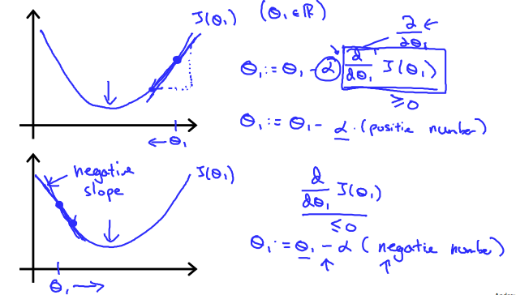
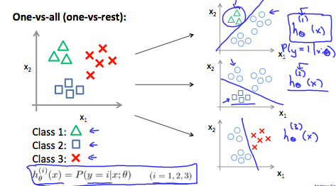
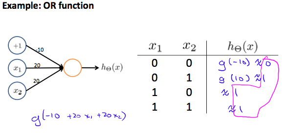

```{r setup, include=FALSE}
knitr::opts_chunk$set(echo = TRUE)

octaveExe<- Sys.getenv("octaveExe")
octaveExe
```

# Week 1

## What is Machine Learning?

Arthur Samuel described it as: **"the field of study that gives computers the ability to learn without being explicitly programmed."** 
This is an older, informal definition.

Modern: Tom Mitchell (1998) defines machine learning by saying that a well-posed learning problem is defined as follows. 

- **Well-posed Learning Problem: A computer program is said to learn from experience E with respect to some task T and some performance measure P, if its performance on T, as measured by P, improves with experience E.**

In the checkers example 

- E is the experience of playing the game 10,000's of times against itself. 
- T is the task of playing checkers
- P is probability of winning the next game of checkers. 


Two types of ML algorithms: 

- supervised learning
- unsupervised learning. 


Other types: reinforcement learning, recommended systems.


## Supervised Learning

- Regression problem: Where you are trying to fit a model to explain a continuous
variable by using a predictor. 

- Classification Problem: Where you are trying to fit a model to explain a 
bernoulli/binomial variable by using a predictor. - When you have multiple
predictors it makes sense to visualize it with the predictors and point label the
outcome variable. 


### Supervised Learning (note)
In supervised learning, we are given a data set and already know what our correct
output should look like, having the idea that there is a relationship between the
input and the output.

Supervised learning problems are categorized into "regression" and "classification" 
problems. In a regression problem, we are trying to predict results within a 
continuous output, meaning that we are trying to map input variables to some 
continuous function. 

In a classification problem, we are instead trying to predict results in a 
discrete output. In other words, we are trying to map input variables into 
discrete categories.

Example 1:

Given data about the size of houses on the real estate market, try to predict 
their price. Price as a function of size is a continuous output, so this is a 
regression problem.

We could turn this example into a classification problem by instead making our 
output about whether the house "sells for more or less than the asking price." 
Here we are classifying the houses based on price into two discrete categories.

Example 2:

(a) Regression - Given a picture of a person, we have to predict their age on the
basis of the given picture

(b) Classification - Given a patient with a tumor, we have to predict whether the
tumor is malignant or benign.

## Unsupervised Learning

Unsupervised learning allows us to approach problems with little or no idea what 
our results should look like. We can derive structure from data where we don't 
necessarily know the effect of the variables.

We can derive this structure by clustering the data based on relationships among 
the variables in the data.

With unsupervised learning there is no feedback based on the prediction results.

Example:

Clustering: Take a collection of 1,000,000 different genes, and find a way to 
automatically group these genes into groups that are somehow similar or related 
by different variables, such as lifespan, location, roles, and so on.

Non-clustering: The "Cocktail Party Algorithm", allows you to find structure in 
a chaotic environment. (i.e. identifying individual voices and music from a mesh 
of sounds at a cocktail party).


## Model Representation


To establish notation for future use, we’ll use $x^{i}$ to denote the “input” 
variables (living area in this example), also called input features, and $y^{i}$
to denote the “output” or target variable that we are trying to predict (price). 
A pair ($x^{i}$ , $y^{i}$) is called a training example, and the dataset that 
we’ll be using to learn—a list of m training examples {($x^{(i)}$ , $y^{(i)}$ ); 
i = 1, . . . , m—is called a training set. Note that the superscript “(i)” in the 
notation is simply an index into the training set, and has nothing to do with 
exponentiation. We will also use X to denote the space of input values, and Y to 
denote the space of output values. In this example, X = Y = ℝ.

To describe the supervised learning problem slightly more formally, our goal is, 
given a training set, to learn a function h : X → Y so that h(x) is a “good” 
predictor for the corresponding value of y. For historical reasons, this function 
h is called a hypothesis. Seen pictorially, the process is therefore like this:


When the target variable that we’re trying to predict is continuous, such as in 
our housing example, we call the learning problem a regression problem. When y 
can take on only a small number of discrete values (such as if, given the living 
area, we wanted to predict if a dwelling is a house or an apartment, say), we 
call it a classification problem.


## Cost Function

We can measure the accuracy of our hypothesis function by using a cost function. 
This takes an average difference (actually a fancier version of an average) of 
all the results of the hypothesis with inputs from x's and the actual output y's.

$J(\theta_0, \theta_1) = \dfrac {1}{2m} \displaystyle \sum _{i=1}^m \left ( \hat{y}_{i}- y_{i} \right)^2 = \dfrac {1}{2m} \displaystyle \sum _{i=1}^m \left (h_\theta (x_{i}) - y_{i} \right)^2$

To break it apart, it is $\frac{1}{2} \bar{x}$ where $\bar{x}$ is the mean of the 
squares of $h_\theta (x_{i}) - y_{i}$, or the difference between the predicted 
value and the actual value.

This function is otherwise called the **"Squared error function"**, or **"Mean squared error"**. The mean is halved $\left(\frac{1}{2}\right)$ as a convenience for the 
computation of the gradient descent, as the derivative term of the square function
will cancel out the $\frac{1}{2}$ term. 

The following image summarizes what the cost function does:


## Cost Function - Intution I

If we try to think of it in visual terms, our training data set is scattered on the x-y plane. We are trying to make a straight line (defined by $h_\theta(x)$) which passes through these scattered data points.

Our objective is to get the best possible line. The best possible line will be such so that the average squared vertical distances of the scattered points from the line will be the least. Ideally, the line should pass through all the points of our training data set. In such a case, the value of $J(\theta_0, \theta_1)$ will be 0. The following example shows the ideal situation where we have a cost function of 0.


When $\theta_1 = 1$, we get a slope of 1 which goes through every single data point in our model. Conversely, when $\theta_1 = 0.5$, we see the vertical distance from our fit to the data points increase.


This increases our cost function to 0.58. Plotting several other points yields to the following graph:


Thus as a goal, we should try to minimize the cost function. In this case, $\theta_1 = 1$ is our global minimum.

## Cost Function - Intution II

A contour plot is a graph that contains many contour lines. A contour line of a two variable function has a constant value at all points of the same line. An example of such a graph is the one to the right below.


Taking any color and going along the 'circle', one would expect to get the same value of the cost function. For example, the three green points found on the green line above have the same value for $J(\theta_0,\theta_1)$ and as a result, they are found along the same line. The circled x displays the value of the cost function for the graph on the left when $\theta_0 = 800$ and $\theta_1 = -0.15$. Taking another h(x) and plotting its contour plot, one gets the following graphs:


When $\theta_0 = 360$ and $\theta_1 = 0$, the value of $J(\theta_0,\theta_1)$ in the contour plot gets closer to the center thus reducing the cost function error. Now giving our hypothesis function a slightly positive slope results in a better fit of the data.


The graph above minimizes the cost function as much as possible and consequently, the result of $\theta_1$ and $\theta_0$ tend to be around 0.12 and 250 respectively. Plotting those values on our graph to the right seems to put our point in the center of the inner most 'circle'.

## Gradient Descent

So we have our hypothesis function and we have a way of measuring how well it fits into the data. Now we need to estimate the parameters in the hypothesis function. That's where gradient descent comes in.

Imagine that we graph our hypothesis function based on its fields $\theta_0$ and $\theta_1$ (actually we are graphing the cost function as a function of the parameter estimates). We are not graphing x and y itself, but the parameter range of our hypothesis function and the cost resulting from selecting a particular set of parameters.

We put $\theta_0$ on the x axis and $\theta_1$ on the y axis, with the cost function on the vertical z axis. The points on our graph will be the result of the cost function using our hypothesis with those specific theta parameters. The graph below depicts such a setup.


We will know that we have succeeded when our cost function is at the very bottom of the pits in our graph, i.e. when its value is the minimum. The red arrows show the minimum points in the graph.

The way we do this is by taking the derivative (the tangential line to a function) of our cost function. The slope of the tangent is the derivative at that point and it will give us a direction to move towards. We make steps down the cost function in the direction with the steepest descent. The size of each step is determined by the parameter α, which is called the learning rate.

For example, the distance between each 'star' in the graph above represents a step determined by our parameter α. A smaller α would result in a smaller step and a larger α results in a larger step. The direction in which the step is taken is determined by the partial derivative of $J(\theta_0,\theta_1)$. Depending on where one starts on the graph, one could end up at different points. The image above shows us two different starting points that end up in two different places.

The gradient descent algorithm is:

repeat until convergence:

$\theta_j := \theta_j - \alpha \frac{\partial}{\partial \theta_j} J(\theta_0, \theta_1)$

where

j=0,1 represents the feature index number. (In Econometrics this is just the $\beta_0$ and $\beta_1$ here intercept and the slop for the first explanatory variable)

At each iteration j, one should simultaneously update the parameters $\theta_1, \theta_2,...,\theta_n$. Updating a specific parameter prior to calculating another one on the $j^{(th)}$ iteration would yield to a wrong implementation.


## Gradient Descent Intution

In this video we explored the scenario where we used one parameter $\theta_1$ and plotted its cost function to implement a gradient descent. Our formula for a single parameter was :

Repeat until convergence:

$\theta_1:=\theta_1-\alpha \frac{d}{d\theta_1} J(\theta_1)$

Regardless of the slope's sign for $\frac{d}{d\theta_1} J(\theta_1)$, $\theta_1$ eventually converges to its minimum value. The following graph shows that when the slope is negative, the value of $\theta_1$ increases and when it is positive, the value of $\theta_1$ decreases.




On a side note, we should adjust our parameter $\alpha$ to ensure that the gradient descent algorithm converges in a reasonable time. Failure to converge or too much time to obtain the minimum value imply that our step size is wrong.


How does gradient descent converge with a fixed step size $\alpha$?
The intuition behind the convergence is that $\frac{d}{d\theta_1} J(\theta_1)$ approaches 0 as we approach the bottom of our convex function. At the minimum, the derivative will always be 0 and thus we get:

$\theta_1:=\theta_1-\alpha * 0$


## Gradient Descent for Linear Regression


When specifically applied to the case of linear regression, a new form of the gradient descent equation can be derived. We can substitute our actual cost function and our actual hypothesis function and modify the equation to :

$\begin{align*} \text{repeat until convergence: } \lbrace & \newline \theta_0 := & \theta_0 - \alpha \frac{1}{m} \sum\limits_{i=1}^{m}(h_\theta(x_{i}) - y_{i}) \newline \theta_1 := & \theta_1 - \alpha \frac{1}{m} \sum\limits_{i=1}^{m}\left((h_\theta(x_{i}) - y_{i}) x_{i}\right) \newline \rbrace& \end{align*}$

where m is the size of the training set, $\theta_0$ a constant that will be changing simultaneously with $\theta_1$ and $x_{i}, y_{i}$ are values of the given training set (data).

Note that we have separated out the two cases for $\theta_j$ into separate equations for $\theta_0$ and $\theta_1$; and that for $\theta_1$ we are multiplying $x_{i}$ at the end due to the derivative.

The following is a derivation of $\frac {\partial}{\partial \theta_j}J(\theta)$ for a single example :


The point of all this is that if we start with a guess for our hypothesis and then repeatedly apply these gradient descent equations, our hypothesis will become more and more accurate.

So, this is simply gradient descent on the original cost function J. This method looks at every example in the entire training set on every step, and is called **batch gradient descent**. Note that, while gradient descent can be susceptible to local minima in general, the optimization problem we have posed here for linear regression has only one global, and no other local, optima; thus gradient descent always converges (assuming the learning rate α is not too large) to the global minimum. Indeed, J is a convex quadratic function. Here is an example of gradient descent as it is run to minimize a quadratic function.


The ellipses shown above are the contours of a quadratic function. Also shown is the trajectory taken by gradient descent, which was initialized at (48,30). The x’s in the figure (joined by straight lines) mark the successive values of θ that gradient descent went through as it converged to its minimum.


#### Additonal self note

<span style="color:red">
Actually, if you replace $\\h_\theta (x_i)$ with $\theta_0 + \theta_1*X_i$, in the cost function then you can derive the partial derivative yourself and you will get the same results. Plus the multivariate gradient descent should come as a normal extension of what is done here. Essentially, you are holding all explanatory variables constant then mapping the slope of one explanatory variable or the intercept against the cost function. Finding the slop and adjusting the value depending on this slope and  also doing all this simultaneously of course.
</span>


$J(\theta_0, \theta_1) = \dfrac {1}{2m} \displaystyle \sum _{i=1}^m \left ( \hat{y}_{i}- y_{i} \right)^2 = \dfrac {1}{2m} \displaystyle \sum _{i=1}^m \left (h_\theta (x_{i}) - y_{i} \right)^2$

$J(\theta_0, \theta_1) = \dfrac {1}{2m} \displaystyle \sum _{i=1}^m \left (h_\theta (x_{i}) - y_{i} \right)^2$

$J(\theta_0, \theta_1) = \dfrac {1}{2m} \displaystyle \sum _{i=1}^m \left ((\theta_0 + \theta_1*X_i) - y_{i} \right)^2$

<span style="color:red">i.e partial derivative of the last equation with respect to $\theta_0$ and $\theta_1$.</span>


## Matrices and Vectors

Matrices are 2-dimensional arrays:

$\begin{bmatrix} a & b & c \newline d & e & f \newline g & h & i \newline j & k & l\end{bmatrix}$

The above matrix has four rows and three columns, so it is a 4 x 3 matrix.

A vector is a matrix with one column and many rows:

$\begin{bmatrix} w \newline x \newline y \newline z \end{bmatrix}$

So vectors are a subset of matrices. The above vector is a 4 x 1 matrix.

Notation and terms:

- $A_{ij}$ refers to the element in the ith row and jth column of matrix A.
- A vector with 'n' rows is referred to as an 'n'-dimensional vector.
- $v_i$ refers to the element in the ith row of the vector.
- In general, all our vectors and matrices will be 1-indexed. Note that for some programming languages, the arrays are 0-indexed.
- Matrices are usually denoted by uppercase names while vectors are lowercase.
- "Scalar" means that an object is a single value, not a vector or matrix.
- $\mathbb{R}$ refers to the set of scalar real numbers.
- $\mathbb{R^n}$ refers to the set of n-dimensional vectors of real numbers.

Run the cell below to get familiar with the commands in Octave/Matlab. Feel free to create matrices and vectors and try out different things.


```{octave, engine.path=octaveExe}
% The ; denotes we are going back to a new row.
A = [1, 2, 3; 4, 5, 6; 7, 8, 9; 10, 11, 12]

% Initialize a vector 
v = [1;2;3] 

% Get the dimension of the matrix A where m = rows and n = columns
[m,n] = size(A)

% You could also store it this way
dim_A = size(A)

% Get the dimension of the vector v 
dim_v = size(v)

% Now let's index into the 2nd row 3rd column of matrix A
A_23 = A(2,3)
```

## Addition and Scalar Multiplication

Addition and subtraction are element-wise, so you simply add or subtract each corresponding element:

$\begin{bmatrix} a & b \newline c & d \newline \end{bmatrix} +\begin{bmatrix} w & x \newline y & z \newline \end{bmatrix} =\begin{bmatrix} a+w & b+x \newline c+y & d+z \newline \end{bmatrix}$

Subtracting Matrices:

$\begin{bmatrix} a & b \newline c & d \newline \end{bmatrix} - \begin{bmatrix} w & x \newline y & z \newline \end{bmatrix} =\begin{bmatrix} a-w & b-x \newline c-y & d-z \newline \end{bmatrix}$

To add or subtract two matrices, their dimensions must be the same.

In scalar multiplication, we simply multiply every element by the scalar value:

$\begin{bmatrix} a & b \newline c & d \newline \end{bmatrix} * x =\begin{bmatrix} a*x & b*x \newline c*x & d*x \newline \end{bmatrix}$

In scalar division, we simply divide every element by the scalar value:

$\begin{bmatrix} a & b \newline c & d \newline \end{bmatrix} / x =\begin{bmatrix} a /x & b/x \newline c /x & d /x \newline \end{bmatrix}$

Experiment below with the Octave/Matlab commands for matrix addition and scalar multiplication. Feel free to try out different commands. Try to write out your answers for each command before running the cell below.

```{octave, engine.path=octaveExe}

% Initialize matrix A and B 
A = [1, 2, 4; 5, 3, 2]
B = [1, 3, 4; 1, 1, 1]

% Initialize constant s 
s = 2

% See how element-wise addition works
add_AB = A + B 

% See how element-wise subtraction works
sub_AB = A - B

% See how scalar multiplication works
mult_As = A * s

% Divide A by s
div_As = A / s

% What happens if we have a Matrix + scalar?
add_As = A + s

```

## Matrix-Vector Multiplication


We map the column of the vector onto each row of the matrix, multiplying each element and summing the result.

$\begin{bmatrix} a & b \newline c & d \newline e & f \end{bmatrix} *\begin{bmatrix} x \newline y \newline \end{bmatrix} =\begin{bmatrix} a*x + b*y \newline c*x + d*y \newline e*x + f*y\end{bmatrix}$

The result is a **vector**. The number of **columns** of the matrix must equal the number of **rows** of the vector.

An **m x n matrix** multiplied by an **n x 1** vector results in an **m x 1 vector**.

Below is an example of a matrix-vector multiplication. Make sure you understand how the multiplication works. Feel free to try different matrix-vector multiplications.

```{octave, engine.path = octaveExe}

% Initialize matrix A 
A = [1, 2, 3; 4, 5, 6;7, 8, 9] 

% Initialize vector v 
v = [1; 1; 1] 

% Multiply A * v
Av = A * v

```

## Matrix-Matrix Multiplication

We multiply two matrices by breaking it into several vector multiplications and concatenating the result.

$\begin{bmatrix} a & b \newline c & d \newline e & f \end{bmatrix} *\begin{bmatrix} w & x \newline y & z \newline \end{bmatrix} =\begin{bmatrix} a*w + b*y & a*x + b*z \newline c*w + d*y & c*x + d*z \newline e*w + f*y & e*x + f*z\end{bmatrix}$

An **m x n matrix** multiplied by an **n x o matrix** results in an **m x o** matrix. In the above example, a 3 x 2 matrix times a 2 x 2 matrix resulted in a 3 x 2 matrix.


To multiply two matrices, the number of **columns** of the first matrix must equal the number of **rows** of the second matrix.

For example:

```{octave, engine.path = octaveExe}

% Initialize a 3 by 2 matrix 
A = [1, 2; 3, 4;5, 6]

% Initialize a 2 by 1 matrix 
B = [1; 2] 

% We expect a resulting matrix of (3 by 2)*(2 by 1) = (3 by 1) 
mult_AB = A*B

% Make sure you understand why we got that result

```


## Matrix Multiplication Properties

- Matrices are not commutative: $A∗B \neq B∗A$
- Matrices are associative: $(A∗B)∗C = A∗(B∗C)$

The **identity matrix**, when multiplied by any matrix of the same dimensions, results in the original matrix. It's just like multiplying numbers by 1. The identity matrix simply has 1's on the diagonal (upper left to lower right diagonal) and 0's elsewhere.

$\begin{bmatrix} 1 & 0 & 0 \newline 0 & 1 & 0 \newline 0 & 0 & 1 \newline \end{bmatrix}$ 

When multiplying the identity matrix after some matrix (A∗I), the square identity matrix's dimension should match the other matrix's **columns**. When multiplying the identity matrix before some other matrix (I∗A), the square identity matrix's dimension should match the other matrix's **rows**.


```{octave, engine.path = octaveExe}
% Initialize random matrices A and B 
A = [1,2;4,5]
B = [1,1;0,2]

% Initialize a 2 by 2 identity matrix
I = eye(2)

% The above notation is the same as I = [1,0;0,1]

% What happens when we multiply I*A ? 
IA = I*A 

% How about A*I ? 
AI = A*I 

% Compute A*B 
AB = A*B 

% Is it equal to B*A? 
BA = B*A 

% Note that IA = AI but AB != BA

```


## Inverse and Transpose


The **inverse** of a matrix A is denoted $A^{-1}$. Multiplying by the inverse results in the identity matrix.

A non square matrix does not have an inverse matrix. We can compute inverses of matrices in octave with the $pinv(A)$ function and in Matlab with the $inv(A)$ function. Matrices that don't have an inverse are **singular** or **degenerate**.

The **transposition** of a matrix is like rotating the matrix 90° in clockwise direction and then reversing it. We can compute transposition of matrices in matlab with the transpose(A) function or A':

$A = \begin{bmatrix} a & b \newline c & d \newline e & f \end{bmatrix}$

$A^T = \begin{bmatrix} a & c & e \newline b & d & f \newline \end{bmatrix}$

In other words:

$A_{ij} = A^T_{ji}$


```{octave, engine.path = octaveExe}
% Initialize matrix A 
A = [1,2,0;0,5,6;7,0,9]

% Transpose A 
A_trans = A' 

% Take the inverse of A 
A_inv = inv(A)


% What is A^(-1)*A? 
A_invA = inv(A)*A
```

# Week 2
## Multiple features

Linear regression with multiple variables is also known as "multivariate linear regression".

We now introduce notation for equations where we can have any number of input variables.

$\begin{align*}x_j^{(i)} &= \text{value of feature } j \text{ in the }i^{th}\text{ training example} \newline x^{(i)}& = \text{the input (features) of the }i^{th}\text{ training example} \newline m &= \text{the number of training examples} \newline n &= \text{the number of features} \end{align*}$

The multivariable form of the hypothesis function accommodating these multiple features is as follows:

$h_\theta (x) = \theta_0 + \theta_1 x_1 + \theta_2 x_2 + \theta_3 x_3 + \cdots + \theta_n x_n$
 

In order to develop intuition about this function, we can think about $\theta_0$ as the basic price of a house, $\theta_1$ as the price per square meter, $\theta_2$ as the price per floor, etc. $x_1$ will be the number of square meters in the house, $x_2$ the number of floors, etc.


Using the definition of matrix multiplication, our multivariable hypothesis function can be concisely represented as:

$\begin{align*}h_\theta(x) =\begin{bmatrix}\theta_0 \hspace{2em} \theta_1 \hspace{2em} ... \hspace{2em} \theta_n\end{bmatrix}\begin{bmatrix}x_0 \newline x_1 \newline \vdots \newline x_n\end{bmatrix}= \theta^T x\end{align*}$


This is a vectorization of our hypothesis function for one training example; see the lessons on vectorization to learn more.


Remark: Note that for convenience reasons in this course we assume $x_{0}^{(i)} =1 \text{ for } (i\in { 1,\dots, m } )$. This allows us to do matrix operations with theta and x. Hence making the two vectors $'\theta'$ and $x^{(i)}$ match each other element-wise (that is, have the same number of elements: n+1).


## Gradient Descent for Multiple Variables

The gradient descent equation itself is generally the same form; we just have to repeat it for our 'n' features:

$\begin{align*} & \text{repeat until convergence:} \; \lbrace \newline \; & \theta_0 := \theta_0 - \alpha \frac{1}{m} \sum\limits_{i=1}^{m} (h_\theta(x^{(i)}) - y^{(i)}) \cdot x_0^{(i)}\newline \; & \theta_1 := \theta_1 - \alpha \frac{1}{m} \sum\limits_{i=1}^{m} (h_\theta(x^{(i)}) - y^{(i)}) \cdot x_1^{(i)} \newline \; & \theta_2 := \theta_2 - \alpha \frac{1}{m} \sum\limits_{i=1}^{m} (h_\theta(x^{(i)}) - y^{(i)}) \cdot x_2^{(i)} \newline & \cdots \newline \rbrace \end{align*}$

In other words:

$\begin{align*}& \text{repeat until convergence:} \; \lbrace \newline \; & \theta_j := \theta_j - \alpha \frac{1}{m} \sum\limits_{i=1}^{m} (h_\theta(x^{(i)}) - y^{(i)}) \cdot x_j^{(i)} \; & \text{for j := 0...n}\newline \rbrace\end{align*}$

The following image compares gradient descent with one variable to gradient descent with multiple variables:


#### Additonal self note

<span style="color:red">
Refer back to your self note on the one feature gradient descent. Essentially, a more general partial derivative of the cost function is provided here. But the idea of mapping a a feature against the cost function, holding all other features constant, and then adjusting the slop to minimize the cost function applies. 
Again if you replace $h_\theta$ in the cost function with $\theta_0 + \theta_1*x^1 + ... + \theta_n*x^n$ and do the partial derivative of the cost function with respect to each $\theta$ then you will get the same term as shown above. 
</span>


## Gradient Descent in Practice I - Feature Scaling

We can speed up gradient descent by having each of our input values in roughly the same range. This is because θ will descend quickly on small ranges and slowly on large ranges, and so will oscillate inefficiently down to the optimum when the variables are very uneven.

The way to prevent this is to modify the ranges of our input variables so that they are all roughly the same. Ideally:

$−1 ≤ x_{(i)} ≤ 1$

or

$−0.5 ≤ x_{(i)} ≤ 0.5$

These aren't exact requirements; we are only trying to speed things up. The goal is to get all input variables into roughly one of these ranges, give or take a few.

Two techniques to help with this are feature scaling and mean normalization. Feature scaling involves dividing the input values by the range (i.e. the maximum value minus the minimum value) of the input variable, resulting in a new range of just 1. Mean normalization involves subtracting the average value for an input variable from the values for that input variable resulting in a new average value for the input variable of just zero. To implement both of these techniques, adjust your input values as shown in this formula:

$x_i := \dfrac{x_i - \mu_i}{s_i}$
 

Where $\mu_i$ is the average of all the values for feature (i) and $s_i$ is the range of values (max - min), or $s_i$ is the standard deviation.

Note that dividing by the range, or dividing by the standard deviation, give different results. The quizzes in this course use range - the programming exercises use standard deviation.

For example, if $x_i$ represents housing prices with a range of 100 to 2000 and a mean value of 1000, then, $x_i := \dfrac{price-1000}{1900}$.


## Gradient Descent in Practice II - Learning Rate

**Debugging gradient descent**. Make a plot with number of iterations on the x-axis. Now plot the cost function, J(θ) over the number of iterations of gradient descent. If J(θ) ever increases, then you probably need to decrease α.

**Automatic convergence test**. Declare convergence if J(θ) decreases by less than E in one iteration, where E is some small value such as $10^{−3}$. However in practice it's difficult to choose this threshold value.


It has been proven that if learning rate α is sufficiently small, then J(θ) will decrease on every iteration.


To summarize:

If $\alpha$ is too small: slow convergence.

If $\alpha$ is too large: *the objective function* $J(\theta)$ may not decrease on every iteration and thus may not converge.


## Features and Polynomial Regression


We can improve our features and the form of our hypothesis function in a couple different ways.

We can **combine** multiple features into one. For example, we can combine $x_1$ and $x_2$ into a new feature $x_3$ by taking $x_1⋅x_2$.

### Polynomial Regression
Our hypothesis function need not be linear (a straight line) if that does not fit the data well.

We can change the behavior or curve of our hypothesis function by making it a quadratic, cubic or square root function (or any other form).

For example, if our hypothesis function is $h_\theta(x) = \theta_0 + \theta_1 x_1$ then we can create additional features based on $x_1$, to get the quadratic function $h_\theta(x) = \theta_0 + \theta_1 x_1 + \theta_2 x_1^2$ or the cubic function $h_\theta(x) = \theta_0 + \theta_1 x_1 + \theta_2 x_1^2 + \theta_3 x_1^3$


In the cubic version, we have created new features $x_2$ and $x_3$ where $x_2 = x_1^2$ and $x_3 = x_1^3$.

To make it a square root function, we could do: $h_\theta(x) = \theta_0 + \theta_1 x_1 + \theta_2 \sqrt{x_1}$

One important thing to keep in mind is, if you choose your features this way then feature scaling becomes very important.

eg. if $x_1$ has range 1 - 1000 then range of $x_1^2$ becomes 1 - 1000000 and that of $x_1^3$ becomes 1 - 1000000000 (i.e. 1 - $10^9$)

#### Additonal self note

<span style="color:red">
The square root formulation is actually very useful as you usually have feature relations that level out after increasing or decreasing exponentially. 
</span>

```{r}

x = seq(1:100); y = sqrt(x); y1 = 1/sqrt(x)
plot(y~x)
plot(y1~x)
```

  
## Normal Equation


Gradient descent gives one way of minimizing J. Let’s discuss a second way of doing so, this time performing the minimization explicitly and without resorting to an iterative algorithm. In the "Normal Equation" method, we will minimize J by explicitly taking its derivatives with respect to the $θ_j’$s, and setting them to zero. This allows us to find the optimum theta without iteration. The normal equation formula is given below:

$\theta = (X^T X)^{-1}X^T y$


There is no need to do feature scaling with the normal equation.

The following is a comparison of gradient descent and the normal equation:


+-------------------------------+----------------------------------------------+
| Gradient Descent              | Normal Equation                              |
+===============================+==============================================+
|                               | **Normal Equation Advantage**                |
+-------------------------------+----------------------------------------------+
| Need to choose alpha          | No need to choose alpha                      |
+-------------------------------+----------------------------------------------+
| Needs many iterations         | No need to iterate                           |
+-------------------------------+----------------------------------------------+
| **Gradient Descent Advantage**|                                              |
+-------------------------------+----------------------------------------------+
| $O(kn^2)$                     | $O(n^3)$, need to calculate inverse of $X^TX$|
+-------------------------------+----------------------------------------------+
| Works well when n is large    | Slow if n is very large                      |
+-------------------------------+----------------------------------------------+


With the normal equation, computing the inversion has complexity $\mathcal{O}(n^3)$. So if we have a very large number of features, the normal equation will be slow. In practice, when n exceeds 10,000 it might be a good time to go from a normal solution to an iterative process.


## Normal Equation Non-invertibility

When implementing the normal equation in octave we want to use the 'pinv' function rather than 'inv.' The 'pinv' function will give you a value of $\theta$ even if $X^TX$ is not invertible.

If $X^TX$ is **noninvertible**, the common causes might be having :

- Redundant features, where two features are very closely related (i.e. they are linearly dependent)
- Too many features (e.g. m ≤ n). In this case, delete some features or use "regularization" (to be explained in a later lesson).

Solutions to the above problems include deleting a feature that is linearly dependent with another or deleting one or more features when there are too many features.

** In the econometrics discussion the problem of linearly dependnet explanatory variables make it hard to make a decision as to which of the two variables is having the observed effect on the outcome variable. i.e multicollinearity 


## Octave - Basic Operations


```{octave, engine.path = octaveExe}

% percent sign is the comment key for octave

5 + 6 % elementery operations can be done with -, *, /, ^
```

```{octave, engine.path = octaveExe}
1 == 2 % logical operations - evalues to false - it is reprensted with 0
```

```{octave, engine.path = octaveExe}
1 ~= 2 % The not equal to sign is thelta equal symble and not bang equal
```

```{octave, engine.path = octaveExe}
1 && 0 % The AND logical operator - evaluates to 0
```

```{octave, engine.path = octaveExe}
1 || 0 % The OR logicla operator - evalueses to 0
```

```{octave, engine.path = octaveExe}
PS1('>> ') % To change the octave symbole to >>
```

```{octave, engine.path = octaveExe}
ans = 3; % Assignment is done with = and the ; supress prints out. 
```

```{octave, engine.path = octaveExe}
c = (3 >= 1);
```

```{octave, engine.path = octaveExe}
% printing out results

b = 'hi'; 
b % just to print out b
```

```{octave, engine.path = octaveExe}
% for a more complex printing use disp - for display. 

a = pi; 

disp(sprintf('2 decimals: %0.2f', a)) % syntax used to print strings. It will print out a with two decimals. the %0.2f is to say substitute a here and provide two decimal points. If you change 2 to 6 then you will get 6 decimal place. 
```


```{octave, engine.path = octaveExe}
a = pi; 
format long % sets the defualt print to high decimal palces
a 

format short % lower decial place print output
a
```

```{octave, engine.path = octaveExe}
% Matrix

A = [1 2; 3 4; 5 6] % ; says go to the next line. You can write them on different lines if you want. 

```

```{octave, engine.path = octaveExe}
% Vectors

v = [1 2 3] % row vector

v = [1; 2; 3] % column vector
```

```{octave, engine.path = octaveExe}
% Another way to create vectors

v = 1:0.1:2 % Start from 1 and increment by 0.1 until you arrive at 2. If you do not pass increment default would be 1
```

```{octave, engine.path = octaveExe}
% Other ways to generate matrix

ones(2, 3) % arguement row and column specification - generates matrix of 1s 

% can be done for zeros as well. With the ones you can actually create any matrix by multiplying with scalar.

5 * ones(2, 3)
```

```{octave, engine.path = octaveExe}
% random variable matrix

rand(3,3) % matrix of random variables drawn from 0 to 1 with row and column specification.
```

```{octave, engine.path = octaveExe}
% more complex generation.

w = -6 + sqrt(10)*(randn(1, 10000));

hist(w, 50) % second arguement sets the bins for the historgram
```

```{octave, engine.path = octaveExe}
% identitiy matrix

eye (3)
```

```{octave, engine.path = octaveExe}
% documentation and help with help - does not work on rstudio markdown knitting but works in octave.
%help rand 
```


## Moving Data Around

```{octave, engine.path = octaveExe}
% size command returns the dimension of a matrix

A = [1 2; 3 4; 5 6]

size(A)
```

```{octave, engine.path = octaveExe}
% length command returns the length of a vector - can be applied to matrix then returns the longer dimension. But stick to vector for length and size for matrix. 

V = [1 2 3 4]
length(V)

A = [1 2; 3 4; 5 6]
length(A)
```

```{octave, engine.path = octaveExe}
% Load and find data - current working directory is pwd
%pwd

% cd stands for chage directory
%cd 'C:\Users?Charlie\Desktop'
%pwd

% ls lists the directories in the working direcotry 
%ls
```


```{octave, engine.path = octaveExe}
% you load data with load

%load featuresX.dat

% the who command tells you what variables you have in octave while whos gives you more detail.

%who 
%whos

% clear is a command to use to get rid of an object - clear featureX and check with whos
% clear with no arguments clears everything
```

```{octave, engine.path = octaveExe}
A = [1 2 3 4]
% You save with save - hello.dat A
% save hello.dat A
% load hello.dat
```

**Some Practical lessons in octave missing and in the exercise file. Figure a way to include them back into this markdown eventually.**

# Week 3
## Classification

To attempt classification, one method is to use linear regression and map all predictions greater than 0.5 as a 1 and all less than 0.5 as a 0. However, this method doesn't work well because classification is not actually a linear function.

The classification problem is just like the regression problem, except that the values we now want to predict take on only a small number of discrete values. For now, we will focus on the **binary classification problem** in which y can take on only two values, 0 and 1. (Most of what we say here will also generalize to the multiple-class case.) For instance, if we are trying to build a spam classifier for email, then $x^{(i)}$ may be some features of a piece of email, and y may be 1 if it is a piece of spam mail, and 0 otherwise. Hence, $y∈{\{0,1\}}$. 0 is also called the negative class, and 1 the positive class, and they are sometimes also denoted by the symbols “-” and “+.” Given $x^{(i)}$, the corresponding $y^{(i)}$ is also called the label for the training example.

## Logistic regression - Hpothesis Representation

We could approach the classification problem ignoring the fact that y is discrete-valued, and use our old linear regression algorithm to try to predict y given x. However, it is easy to construct examples where this method performs very poorly. Intuitively, it also doesn’t make sense for $h_\theta (x)$ to take values larger than 1 or smaller than 0 when we know that $y ∈ {\{0, 1\}}$. To fix this, let’s change the form for our hypotheses $h_\theta (x)$ to satisfy $0 \leq h_\theta (x) \leq 1$. This is accomplished by plugging $\theta^Tx$ into the Logistic Function.

Our new form uses the "Sigmoid Function," also called the "Logistic Function":

$\begin{align*}& h_\theta (x) = g ( \theta^T x ) \newline \newline& z = \theta^T x \newline& g(z) = \dfrac{1}{1 + e^{-z}}\end{align*}$

The following image shows us what the sigmoid function looks like:


The function g(z), shown here, maps any real number to the (0, 1) interval, making it useful for transforming an arbitrary-valued function into a function better suited for classification.

$h_\theta(x)$ will give us the probability that our output is 1. For example, $h_\theta(x)=0.7$ gives us a probability of 70% that our output is 1. Our probability that our prediction is 0 is just the complement of our probability that it is 1 (e.g. if probability that it is 1 is 70%, then the probability that it is 0 is 30%).

$\begin{align*}& h_\theta(x) = P(y=1 | x ; \theta) = 1 - P(y=0 | x ; \theta) \newline& P(y = 0 | x;\theta) + P(y = 1 | x ; \theta) = 1\end{align*}$

## Decision Boundary
In order to get our discrete 0 or 1 classification, we can translate the output of the hypothesis function as follows:

$\begin{align*}& h_\theta(x) \geq 0.5 \rightarrow y = 1 \newline& h_\theta(x) < 0.5 \rightarrow y = 0 \newline\end{align*}$

The way our logistic function g behaves is that when its input is greater than or equal to zero, its output is greater than or equal to 0.5:

$\begin{align*}& g(z) \geq 0.5 \newline& when \; z \geq 0\end{align*}$

Remember.

$\begin{align*}z=0, e^{0}=1 \Rightarrow g(z)=1/2\newline z \to \infty, e^{-\infty} \to 0 \Rightarrow g(z)=1 \newline z \to -\infty, e^{\infty}\to \infty \Rightarrow g(z)=0 \end{align*}$

So if our input to g is $\theta^T X$, then that means:

$\begin{align*}& h_\theta(x) = g(\theta^T x) \geq 0.5 \newline& when \; \theta^T x \geq 0\end{align*}$

From these statements we can now say:

$\begin{align*}& \theta^T x \geq 0 \Rightarrow y = 1 \newline& \theta^T x < 0 \Rightarrow y = 0 \newline\end{align*}$

The **decision boundary** is the line that separates the area where y = 0 and where y = 1. It is created by our hypothesis function.

Example:

$\begin{align*}& \theta = \begin{bmatrix}5 \newline -1 \newline 0\end{bmatrix} \newline & y = 1 \; if \; 5 + (-1) x_1 + 0 x_2 \geq 0 \newline & 5 - x_1 \geq 0 \newline & - x_1 \geq -5 \newline& x_1 \leq 5 \newline \end{align*}$

In this case, our decision boundary is a straight vertical line placed on the graph where $x_1 = 5$, and everything to the left of that denotes y = 1, while everything to the right denotes y = 0.

Again, the input to the sigmoid function g(z) (e.g. $\theta^T X$) doesn't need to be linear, and could be a function that describes a circle (e.g. $z = \theta_0 + \theta_1 x_1^2 +\theta_2 x_2^2$) or any shape to fit our data.

## Logistic Regression - Cost Function

We cannot use the same cost function that we use for linear regression because the Logistic Function will cause the output to be wavy, causing many local optima. In other words, it will not be a convex function.

Instead, our cost function for logistic regression looks like:

$\begin{align*}& J(\theta) = \dfrac{1}{m} \sum_{i=1}^m \mathrm{Cost}(h_\theta(x^{(i)}),y^{(i)}) \newline & \mathrm{Cost}(h_\theta(x),y) = -\log(h_\theta(x)) \; & \text{if y = 1} \newline & \mathrm{Cost}(h_\theta(x),y) = -\log(1-h_\theta(x)) \; & \text{if y = 0}\end{align*}$

When y = 1, we get the following plot for $J(\theta)$ vs $h_\theta (x)$:


Similarly, when y = 0, we get the following plot for $J(\theta)$ vs $h_\theta (x)$:


$\begin{align*}& \mathrm{Cost}(h_\theta(x),y) = 0 \text{ if } h_\theta(x) = y \newline & \mathrm{Cost}(h_\theta(x),y) \rightarrow \infty \text{ if } y = 0 \; \mathrm{and} \; h_\theta(x) \rightarrow 1 \newline & \mathrm{Cost}(h_\theta(x),y) \rightarrow \infty \text{ if } y = 1 \; \mathrm{and} \; h_\theta(x) \rightarrow 0 \newline \end{align*}$

If our correct answer 'y' is 0, then the cost function will be 0 if our hypothesis function also outputs 0. If our hypothesis approaches 1, then the cost function will approach infinity.

If our correct answer 'y' is 1, then the cost function will be 0 if our hypothesis function outputs 1. If our hypothesis approaches 0, then the cost function will approach infinity.

Note that writing the cost function in this way guarantees that J(θ) is convex for logistic regression.


## Simplified Cost Functin and Gradient Descent - LogReg

We can compress our cost function's two conditional cases into one case:

$\mathrm{Cost}(h_\theta(x),y) = - y \; \log(h_\theta(x)) - (1 - y) \log(1 - h_\theta(x))$

Notice that when y is equal to 1, then the second term $(1-y)\log(1-h_\theta(x))$ will be zero and will not affect the result. If y is equal to 0, then the first term $-y \log(h_\theta(x))$ will be zero and will not affect the result.

We can fully write out our entire cost function as follows:

$J(\theta) = - \frac{1}{m} \displaystyle \sum_{i=1}^m [y^{(i)}\log (h_\theta (x^{(i)})) + (1 - y^{(i)})\log (1 - h_\theta(x^{(i)}))]$

A vectorized implementation is:

<span style="color:red">
$\begin{align*} & h = g(X\theta)\newline & J(\theta) = \frac{1}{m} \cdot \left(-y^{T}\log(h)-(1-y)^{T}\log(1-h)\right) \end{align*}$
</span>

### Gradient Descent

Remember that the general form of gradient descent is:

$\begin{align*}& Repeat \; \lbrace \newline & \; \theta_j := \theta_j - \alpha \dfrac{\partial}{\partial \theta_j}J(\theta) \newline & \rbrace\end{align*}$

We can work out the derivative part using calculus to get:

$\begin{align*} & Repeat \; \lbrace \newline & \; \theta_j := \theta_j - \frac{\alpha}{m} \sum_{i=1}^m (h_\theta(x^{(i)}) - y^{(i)}) x_j^{(i)} \newline & \rbrace \end{align*}$

Notice that this algorithm is identical to the one we used in linear regression. We still have to simultaneously update all values in theta.

A vectorized implementation is:

<span style="color: red">
$\theta := \theta - \frac{\alpha}{m} X^{T} (g(X \theta ) - \vec{y})$
</span>

### Partial derivative of J(θ)
First calculate derivative of sigmoid function (it will be useful while finding partial derivative of J(θ)):

$\begin{align*}\sigma(x)'&=\left(\frac{1}{1+e^{-x}}\right)'=\frac{-(1+e^{-x})'}{(1+e^{-x})^2}=\frac{-1'-(e^{-x})'}{(1+e^{-x})^2}=\frac{0-(-x)'(e^{-x})}{(1+e^{-x})^2}=\frac{-(-1)(e^{-x})}{(1+e^{-x})^2}=\frac{e^{-x}}{(1+e^{-x})^2} \newline &=\left(\frac{1}{1+e^{-x}}\right)\left(\frac{e^{-x}}{1+e^{-x}}\right)=\sigma(x)\left(\frac{+1-1 + e^{-x}}{1+e^{-x}}\right)=\sigma(x)\left(\frac{1 + e^{-x}}{1+e^{-x}} - \frac{1}{1+e^{-x}}\right)=\sigma(x)(1 - \sigma(x))\end{align*}$

Now we are ready to find out resulting partial derivative:

$\begin{align*}\frac{\partial}{\partial \theta_j} J(\theta) &= \frac{\partial}{\partial \theta_j} \frac{-1}{m}\sum_{i=1}^m \left [ y^{(i)} log (h_\theta(x^{(i)})) + (1-y^{(i)}) log (1 - h_\theta(x^{(i)})) \right ] \newline&= - \frac{1}{m}\sum_{i=1}^m \left [ y^{(i)} \frac{\partial}{\partial \theta_j} log (h_\theta(x^{(i)})) + (1-y^{(i)}) \frac{\partial}{\partial \theta_j} log (1 - h_\theta(x^{(i)}))\right ] \newline&= - \frac{1}{m}\sum_{i=1}^m \left [ \frac{y^{(i)} \frac{\partial}{\partial \theta_j} h_\theta(x^{(i)})}{h_\theta(x^{(i)})} + \frac{(1-y^{(i)})\frac{\partial}{\partial \theta_j} (1 - h_\theta(x^{(i)}))}{1 - h_\theta(x^{(i)})}\right ] \newline&= - \frac{1}{m}\sum_{i=1}^m \left [ \frac{y^{(i)} \frac{\partial}{\partial \theta_j} \sigma(\theta^T x^{(i)})}{h_\theta(x^{(i)})} + \frac{(1-y^{(i)})\frac{\partial}{\partial \theta_j} (1 - \sigma(\theta^T x^{(i)}))}{1 - h_\theta(x^{(i)})}\right ] \newline&= - \frac{1}{m}\sum_{i=1}^m \left [ \frac{y^{(i)} \sigma(\theta^T x^{(i)}) (1 - \sigma(\theta^T x^{(i)})) \frac{\partial}{\partial \theta_j} \theta^T x^{(i)}}{h_\theta(x^{(i)})} + \frac{- (1-y^{(i)}) \sigma(\theta^T x^{(i)}) (1 - \sigma(\theta^T x^{(i)})) \frac{\partial}{\partial \theta_j} \theta^T x^{(i)}}{1 - h_\theta(x^{(i)})}\right ] \newline&= - \frac{1}{m}\sum_{i=1}^m \left [ \frac{y^{(i)} h_\theta(x^{(i)}) (1 - h_\theta(x^{(i)})) \frac{\partial}{\partial \theta_j} \theta^T x^{(i)}}{h_\theta(x^{(i)})} - \frac{(1-y^{(i)}) h_\theta(x^{(i)}) (1 - h_\theta(x^{(i)})) \frac{\partial}{\partial \theta_j} \theta^T x^{(i)}}{1 - h_\theta(x^{(i)})}\right ] \newline&= - \frac{1}{m}\sum_{i=1}^m \left [ y^{(i)} (1 - h_\theta(x^{(i)})) x^{(i)}_j - (1-y^{(i)}) h_\theta(x^{(i)}) x^{(i)}_j\right ] \newline&= - \frac{1}{m}\sum_{i=1}^m \left [ y^{(i)} (1 - h_\theta(x^{(i)})) - (1-y^{(i)}) h_\theta(x^{(i)}) \right ] x^{(i)}_j \newline&= - \frac{1}{m}\sum_{i=1}^m \left [ y^{(i)} - y^{(i)} h_\theta(x^{(i)}) - h_\theta(x^{(i)}) + y^{(i)} h_\theta(x^{(i)}) \right ] x^{(i)}_j \newline&= - \frac{1}{m}\sum_{i=1}^m \left [ y^{(i)} - h_\theta(x^{(i)}) \right ] x^{(i)}_j \newline&= \frac{1}{m}\sum_{i=1}^m \left [ h_\theta(x^{(i)}) - y^{(i)} \right ] x^{(i)}_j\end{align*}$

The vectorized version;

$\nabla J(\theta) = \frac{1}{m} \cdot X^T \cdot \left(g\left(X\cdot\theta\right) - \vec{y}\right)$

## Advanced Optimization

"Conjugate gradient", "BFGS", and "L-BFGS" are more sophisticated, faster ways to optimize θ that can be used instead of gradient descent. We suggest that you should not write these more sophisticated algorithms yourself (unless you are an expert in numerical computing) but use the libraries instead, as they're already tested and highly optimized. Octave provides them.

We first need to provide a function that evaluates the following two functions for a given input value θ:

$\begin{align*} & J(\theta) \newline \newline & \dfrac{\partial}{\partial \theta_j}J(\theta)\end{align*}$

We can write a single function that returns both of these:

        function [jVal, gradient] = costFunction(theta)
                jVal = [...code to compute J(theta)...];
                gradient = [...code to compute derivative of J(theta)...];
        end


Then we can use octave's "fminunc()" optimization algorithm along with the "optimset()" function that creates an object containing the options we want to send to "fminunc()".

        options = optimset('GradObj', 'on', 'MaxIter', 100);
        initialTheta = zeros(2,1);
                [optTheta, functionVal, exitFlag] = fminunc(@costFunction, initialTheta, options);

We give to the function "fminunc()" our cost function, our initial vector of theta values, and the "options" object that we created beforehand.

## Multiclass Classification: One-vs-all

Now we will approach the classification of data when we have more than two categories. Instead of y = {0,1} we will expand our definition so that y = {0,1...n}.

Since y = {0,1...n}, we divide our problem into n+1 (+1 because the index starts at 0) binary classification problems; in each one, we predict the probability that 'y' is a member of one of our classes.

$\begin{align*}& y \in \lbrace0, 1 ... n\rbrace \newline& h_\theta^{(0)}(x) = P(y = 0 | x ; \theta) \newline& h_\theta^{(1)}(x) = P(y = 1 | x ; \theta) \newline& \cdots \newline& h_\theta^{(n)}(x) = P(y = n | x ; \theta) \newline& \mathrm{prediction} = \max_i( h_\theta ^{(i)}(x) )\newline\end{align*}$

We are basically choosing one class and then lumping all the others into a single second class. We do this repeatedly, applying binary logistic regression to each case, and then use the hypothesis that returned the highest value as our prediction.

The following image shows how one could classify 3 classes:


**To summarize:**

Train a logistic regression classifier $h_\theta^{(i)}(x)$ for each class i to predict the probability that y = i.

To make a prediction on a new x, pick the class i that maximizes $\max h_\theta^{(i)} (x)$


## The Problem of Overfitting

Consider the problem of predicting y from x ∈ R. The leftmost figure below shows the result of fitting a $y = θ_0 + θ_1x$ to a dataset. We see that the data doesn’t really lie on straight line, and so the fit is not very good.


Instead, if we had added an extra feature $x^2$, and fit $y = \theta_0 + \theta_1x + \theta_2x^2$, then we obtain a slightly better fit to the data (See middle figure). Naively, it might seem that the more features we add, the better. However, there is also a danger in adding too many features: The rightmost figure is the result of fitting a $5^{th}$ order polynomial $y = \sum_{j=0} ^5 \theta_j x^j$. We see that even though the fitted curve passes through the data perfectly, we would not expect this to be a very good predictor of, say, housing prices (y) for different living areas (x). Without formally defining what these terms mean, we’ll say the figure on the left shows an instance of underfitting—in which the data clearly shows structure not captured by the model—and the figure on the right is an example of overfitting.

Underfitting, or high bias, is when the form of our hypothesis function h maps poorly to the trend of the data. It is usually caused by a function that is too simple or uses too few features. At the other extreme, overfitting, or high variance, is caused by a hypothesis function that fits the available data but does not generalize well to predict new data. It is usually caused by a complicated function that creates a lot of unnecessary curves and angles unrelated to the data.

This terminology is applied to both linear and logistic regression. There are two main options to address the issue of overfitting:

1) Reduce the number of features:

- Manually select which features to keep.
- Use a model selection algorithm (studied later in the course).

2) Regularization

- Keep all the features, but reduce the magnitude of parameters $\theta_j$.
- Regularization works well when we have a lot of slightly useful features.


## Regularization Cost Function

If we have overfitting from our hypothesis function, we can reduce the weight that some of the terms in our function carry by increasing their cost.

Say we wanted to make the following function more quadratic:

$\theta_0 + \theta_1x + \theta_2x^2 + \theta_3x^3 + \theta_4x^4$

We'll want to eliminate the influence of $\theta_3x^3$ and $\theta_4x^4$. Without actually getting rid of these features or changing the form of our hypothesis, we can instead modify our cost function:

$min_\theta\ \dfrac{1}{2m}\sum_{i=1}^m (h_\theta(x^{(i)}) - y^{(i)})^2 + 1000\cdot\theta_3^2 + 1000\cdot\theta_4^2$

We've added two extra terms at the end to inflate the cost of $\theta_3$ and $\theta_4$. Now, in order for the cost function to get close to zero, we will have to reduce the values of $\theta_3$ and $\theta_4$ to near zero. This will in turn greatly reduce the values of $\theta_3x^3$ and $\theta_4x^4$ in our hypothesis function. As a result, we see that the new hypothesis (depicted by the pink curve) looks like a quadratic function but fits the data better due to the extra small terms $\theta_3x^3$ and $\theta_4x^4$.


We could also regularize all of our theta parameters in a single summation as:

$min_\theta\ \dfrac{1}{2m}\ \sum_{i=1}^m (h_\theta(x^{(i)}) - y^{(i)})^2 + \lambda\ \sum_{j=1}^n \theta_j^2$

The λ, or lambda, is the regularization parameter. It determines how much the costs of our theta parameters are inflated.

Using the above cost function with the extra summation, we can smooth the output of our hypothesis function to reduce overfitting. If lambda is chosen to be too large, it may smooth out the function too much and cause underfitting. Hence, what would happen if $\lambda = 0$ or is too small?


## Regularized Linear Regression

We can apply regularization to both linear regression and logistic regression. We will approach linear regression first.

### Gradient Descent

We will modify our gradient descent function to separate out $\theta_0$ from the rest of the parameters because we do not want to penalize $\theta_0$.

$\begin{align*} & \text{Repeat}\ \lbrace \newline & \ \ \ \ \theta_0 := \theta_0 - \alpha\ \frac{1}{m}\ \sum_{i=1}^m (h_\theta(x^{(i)}) - y^{(i)})x_0^{(i)} \newline & \ \ \ \ \theta_j := \theta_j - \alpha\ \left[ \left( \frac{1}{m}\ \sum_{i=1}^m (h_\theta(x^{(i)}) - y^{(i)})x_j^{(i)} \right) + \frac{\lambda}{m}\theta_j \right] &\ \ \ \ \ \ \ \ \ \ j \in \lbrace 1,2...n\rbrace\newline & \rbrace \end{align*}$

The term $\frac{\lambda}{m}\theta_j$ performs our regularization. With some manipulation our update rule can also be represented as:

$\theta_j := \theta_j(1 - \alpha\frac{\lambda}{m}) - \alpha\frac{1}{m}\sum_{i=1}^m(h_\theta(x^{(i)}) - y^{(i)})x_j^{(i)}$

The first term in the above equation, $1 - \alpha\frac{\lambda}{m}$ will always be less than 1. Intuitively you can see it as reducing the value of $\theta_j$ by some amount on every update. Notice that the second term is now exactly the same as it was before.

### Normal Equation

Now let's approach regularization using the alternate method of the non-iterative normal equation.

To add in regularization, the equation is the same as our original, except that we add another term inside the parentheses:

$\begin{align*}& \theta = \left( X^TX + \lambda \cdot L \right)^{-1} X^Ty \newline& \text{where}\ \ L = \begin{bmatrix} 0 & & & & \newline & 1 & & & \newline & & 1 & & \newline & & & \ddots & \newline & & & & 1 \newline\end{bmatrix}\end{align*}$

L is a matrix with 0 at the top left and 1's down the diagonal, with 0's everywhere else. It should have dimension (n+1)×(n+1). Intuitively, this is the identity matrix (though we are not including $x_0$), multiplied with a single real number λ.

Recall that if m < n, then $X^TX$ is non-invertible. However, when we add the term λ⋅L, then $X^TX + λ⋅L$ becomes invertible.


## Regularized Logistic Regression

We can regularize logistic regression in a similar way that we regularize linear regression. As a result, we can avoid overfitting. The following image shows how the regularized function, displayed by the pink line, is less likely to overfit than the non-regularized function represented by the blue line:


### Cost Function

Recall that our cost function for logistic regression was:

$J(\theta) = - \frac{1}{m} \sum_{i=1}^m \large[ y^{(i)}\ \log (h_\theta (x^{(i)})) + (1 - y^{(i)})\ \log (1 - h_\theta(x^{(i)})) \large]$

We can regularize this equation by adding a term to the end:

$J(\theta) = - \frac{1}{m} \sum_{i=1}^m \large[ y^{(i)}\ \log (h_\theta (x^{(i)})) + (1 - y^{(i)})\ \log (1 - h_\theta(x^{(i)}))\large] + \frac{\lambda}{2m}\sum_{j=1}^n \theta_j^2$
 
The second sum, $\sum_{j=1}^n \theta_j^2$ **means to explicitly exclude** the bias term, $\theta_0$. I.e. the θ vector is indexed from 0 to n (holding n+1 values, $\theta_0$ through $\theta_n$), and this sum explicitly skips $\theta_0$, by running from 1 to n, skipping 0. Thus, when computing the equation, we should continuously update the two following equations:


# Week 4

## Model Representation I

Let's examine how we will represent a hypothesis function using neural networks. At a very simple level, neurons are basically computational units that take inputs (**dendrites**) as electrical inputs (called "spikes") that are channeled to outputs (**axons**). In our model, our dendrites are like the input features $x_1\cdots x_n$, and the output is the result of our hypothesis function. In this model our $x_0$ input node is sometimes called the "bias unit." It is always equal to 1. In neural networks, we use the same logistic function as in classification, $\frac{1}{1 + e^{-\theta^Tx}}$, yet we sometimes call it a sigmoid (logistic) **activation** function. In this situation, our "theta" parameters are sometimes called "weights".

Visually, a simplistic representation looks like:

$\begin{bmatrix}x_0 \newline x_1 \newline x_2 \newline \end{bmatrix}\rightarrow\begin{bmatrix}\ \ \ \newline \end{bmatrix}\rightarrow h_\theta(x)$ 

Our input nodes (layer 1), also known as the "input layer", go into another node (layer 2), which finally outputs the hypothesis function, known as the "output layer".

We can have intermediate layers of nodes between the input and output layers called the "hidden layers."

In this example, we label these intermediate or "hidden" layer nodes $a^2_0 \cdots a^2_n$ and call them "activation units."

\begin{align*}& a_i^{(j)} = \text{"activation" of unit $i$ in layer $j$} \newline& \Theta^{(j)} = \text{matrix of weights controlling function mapping from layer $j$ to layer $j+1$}\end{align*}

If we had one hidden layer, it would look like:

$\begin{bmatrix}x_0 \newline x_1 \newline x_2 \newline x_3\end{bmatrix}\rightarrow\begin{bmatrix}a_1^{(2)} \newline a_2^{(2)} \newline a_3^{(2)} \newline \end{bmatrix}\rightarrow h_\theta(x)$

The values for each of the "activation" nodes is obtained as follows:

<span style="color: red">
$\begin{align*} a_1^{(2)} = g(\Theta_{10}^{(1)}x_0 + \Theta_{11}^{(1)}x_1 + \Theta_{12}^{(1)}x_2 + \Theta_{13}^{(1)}x_3) \newline a_2^{(2)} = g(\Theta_{20}^{(1)}x_0 + \Theta_{21}^{(1)}x_1 + \Theta_{22}^{(1)}x_2 + \Theta_{23}^{(1)}x_3) \newline a_3^{(2)} = g(\Theta_{30}^{(1)}x_0 + \Theta_{31}^{(1)}x_1 + \Theta_{32}^{(1)}x_2 + \Theta_{33}^{(1)}x_3) \newline h_\Theta(x) = a_1^{(3)} = g(\Theta_{10}^{(2)}a_0^{(2)} + \Theta_{11}^{(2)}a_1^{(2)} + \Theta_{12}^{(2)}a_2^{(2)} + \Theta_{13}^{(2)}a_3^{(2)}) \newline \end{align*}$
</span>

This is saying that we compute our activation nodes by using a 3×4 matrix of parameters. We apply each row of the parameters to our inputs to obtain the value for one activation node. Our hypothesis output is the logistic function applied to the sum of the values of our activation nodes, which have been multiplied by yet another parameter matrix $\Theta^{(2)}$ containing the weights for our second layer of nodes.

Each layer gets its own matrix of weights, $\Theta^{(j)}$.

The dimensions of these matrices of weights is determined as follows:

If network has $s_j$ units in layer $j$ and $s_{j+1}$ units in layer $j+1$, then $\Theta^{(j)}$ will be of dimension $s_{j+1} \times (s_j + 1)$.

The +1 comes from the addition in $\Theta^{(j)}$ of the "bias nodes," $x_0$ and $\Theta_0^{(j)}$. In other words the output nodes will not include the bias nodes while the inputs will. The following image summarizes our model representation:


Example: If layer 1 has 2 input nodes and layer 2 has 4 activation nodes. Dimension of $\Theta^{(1)}$ is going to be 4×3 where $s_j = 2$ and $s_{j+1} = 4$, so $s_{j+1} \times (s_j + 1) = 4 \times 3$.


## Model Representation II


To re-iterate, the following is an example of a neural network:

$\begin{align*} a_1^{(2)} = g(\Theta_{10}^{(1)}x_0 + \Theta_{11}^{(1)}x_1 + \Theta_{12}^{(1)}x_2 + \Theta_{13}^{(1)}x_3) \newline a_2^{(2)} = g(\Theta_{20}^{(1)}x_0 + \Theta_{21}^{(1)}x_1 + \Theta_{22}^{(1)}x_2 + \Theta_{23}^{(1)}x_3) \newline a_3^{(2)} = g(\Theta_{30}^{(1)}x_0 + \Theta_{31}^{(1)}x_1 + \Theta_{32}^{(1)}x_2 + \Theta_{33}^{(1)}x_3) \newline h_\Theta(x) = a_1^{(3)} = g(\Theta_{10}^{(2)}a_0^{(2)} + \Theta_{11}^{(2)}a_1^{(2)} + \Theta_{12}^{(2)}a_2^{(2)} + \Theta_{13}^{(2)}a_3^{(2)}) \newline \end{align*}$ 

In this section we'll do a vectorized implementation of the above functions. We're going to define a new variable $z_k^{(j)}$ that encompasses the parameters inside our g function. In our previous example if we replaced by the variable z for all the parameters we would get:

$\begin{align*}a_1^{(2)} = g(z_1^{(2)}) \newline a_2^{(2)} = g(z_2^{(2)}) \newline a_3^{(2)} = g(z_3^{(2)}) \newline \end{align*}$

In other words, for layer j=2 and node k, the variable z will be:

$z_k^{(2)} = \Theta_{k,0}^{(1)}x_0 + \Theta_{k,1}^{(1)}x_1 + \cdots + \Theta_{k,n}^{(1)}x_n$
 
The vector representation of x and $z^{j}$ is:

$\begin{align*}x = \begin{bmatrix}x_0 \newline x_1 \newline\cdots \newline x_n\end{bmatrix} &z^{(j)} = \begin{bmatrix}z_1^{(j)} \newline z_2^{(j)} \newline\cdots \newline z_n^{(j)}\end{bmatrix}\end{align*}$

Setting $x = a^{(1)}$, we can rewrite the equation as:

$z^{(j)} = \Theta^{(j-1)}a^{(j-1)}$
 
We are multiplying our matrix $\Theta^{(j-1)}$ with dimensions $s_j\times (n+1)$ (where $s_j$ is the number of our activation nodes) by our vector $a^{(j-1)}$ with height (n+1). This gives us our vector $z^{(j)}$ with height $s_j$. Now we can get a vector of our activation nodes for layer j as follows:

$a^{(j)} = g(z^{(j)})$

Where our function g can be applied element-wise to our vector $z^{(j)}$.

We can then add a bias unit (equal to 1) to layer j after we have computed $a^{(j)}$. This will be element $a_0^{(j)}$ and will be equal to 1. To compute our final hypothesis, let's first compute another z vector:

$z^{(j+1)} = \Theta^{(j)}a^{(j)}$

We get this final z vector by multiplying the next theta matrix after $\Theta^{(j-1)}$ with the values of all the activation nodes we just got. This last theta matrix $\Theta^{(j)}$ will have only **one row** which is multiplied by one column $a^{(j)}$ so that our result is a single number. We then get our final result with:

$h_\Theta(x) = a^{(j+1)} = g(z^{(j+1)})$

Notice that in this **last step**, between layer j and layer j+1, we are doing **exactly the same thing** as we did in logistic regression. Adding all these intermediate layers in neural networks allows us to more elegantly produce interesting and more complex non-linear hypotheses.

### Examples and Intuitions I

A simple example of applying neural networks is by predicting $x_1$ AND $x_2$, which is the logical 'and' operator and is only true if both $x_1$ and $x_2$ are 1.

The graph of our functions will look like:

$\begin{align*}\begin{bmatrix}x_0 \newline x_1 \newline x_2\end{bmatrix} \rightarrow\begin{bmatrix}g(z^{(2)})\end{bmatrix} \rightarrow h_\Theta(x)\end{align*}$

Remember that $x_0$ is our bias variable and is always 1.

Let's set our first theta matrix as:

$\Theta^{(1)} =\begin{bmatrix}-30 & 20 & 20\end{bmatrix}$

This will cause the output of our hypothesis to only be positive if both $x_1$ and $x_2$ are 1. In other words:

$\begin{align*}& h_\Theta(x) = g(-30 + 20x_1 + 20x_2) \newline \newline & x_1 = 0 \ \ and \ \ x_2 = 0 \ \ then \ \ g(-30) \approx 0 \newline & x_1 = 0 \ \ and \ \ x_2 = 1 \ \ then \ \ g(-10) \approx 0 \newline & x_1 = 1 \ \ and \ \ x_2 = 0 \ \ then \ \ g(-10) \approx 0 \newline & x_1 = 1 \ \ and \ \ x_2 = 1 \ \ then \ \ g(10) \approx 1\end{align*}$

So we have constructed one of the fundamental operations in computers by using a small neural network rather than using an actual AND gate. Neural networks can also be used to simulate all the other logical gates. The following is an example of the logical operator 'OR', meaning either $x_1$ is true or $x_2$ is true, or both:




### Examples and Intuitions II

The $Θ^{(1)}$ matrices for AND, NOR, and OR are:

$\begin{align*}AND:\newline\Theta^{(1)} &=\begin{bmatrix}-30 & 20 & 20\end{bmatrix} \newline NOR:\newline\Theta^{(1)} &= \begin{bmatrix}10 & -20 & -20\end{bmatrix} \newline OR:\newline\Theta^{(1)} &= \begin{bmatrix}-10 & 20 & 20\end{bmatrix} \newline\end{align*}$


We can combine these to get the XNOR logical operator (which gives 1 if $x_1$ and $x_2$ are both 0 or both 1).

$\begin{align*}\begin{bmatrix}x_0 \newline x_1 \newline x_2\end{bmatrix} \rightarrow\begin{bmatrix}a_1^{(2)} \newline a_2^{(2)} \end{bmatrix} \rightarrow\begin{bmatrix}a^{(3)}\end{bmatrix} \rightarrow h_\Theta(x)\end{align*}$


For the transition between the first and second layer, we'll use a $Θ^{(1)}$ matrix that combines the values for AND and NOR:

$\Theta^{(1)} =\begin{bmatrix}-30 & 20 & 20 \newline 10 & -20 & -20\end{bmatrix}$

For the transition between the second and third layer, we'll use a $Θ^{(2)}$ matrix that uses the value for OR:

$\Theta^{(2)} =\begin{bmatrix}-10 & 20 & 20\end{bmatrix}$

Let's write out the values for all our nodes:

$\begin{align*}& a^{(2)} = g(\Theta^{(1)} \cdot x) \newline& a^{(3)} = g(\Theta^{(2)} \cdot a^{(2)}) \newline& h_\Theta(x) = a^{(3)}\end{align*}$

And there we have the XNOR operator using a hidden layer with two nodes! The following summarizes the above algorithm:


## Multiclass Classification

To classify data into multiple classes, we let our hypothesis function return a vector of values. Say we wanted to classify our data into one of four categories. We will use the following example to see how this classification is done. This algorithm takes as input an image and classifies it accordingly:


We can define our set of resulting classes as y:


Each $y^{(i)}$ represents a different image corresponding to either a car, pedestrian, truck, or motorcycle. The inner layers, each provide us with some new information which leads to our final hypothesis function. The setup looks like:
  
 
 Our resulting hypothesis for one set of inputs may look like:

$h_\Theta(x) =\begin{bmatrix}0 \newline 0 \newline 1 \newline 0 \newline\end{bmatrix}$

In which case our resulting class is the third one down, or $h_\Theta(x)_3$, which represents the motorcycle.


# Week 5

## Cost Function and Backpropagation - Neural Networks

### Cost Function

Let's first define a few variables that we will need to use:

  - L = total number of layers in the network - below L = 4
  - $s_l$ = number of units (not counting bias unit) in layer l
      + $s_1 = 3$, $s_2 = 5$, $s_3 = 5$, $s_4 = s_l = K = 4$
  - K = number of output units/classes - below  K  = 4
      + in binary classification K is 1.
      + in multiclassification problems K >= 3 also $s_l = K$


Recall that in neural networks, we may have many output nodes. We denote $h_\Theta(x)_k$ as being a hypothesis that results in the $k^{th}$ output. Our cost function for neural networks is going to be a generalization of the one we used for logistic regression. Recall that the cost function for regularized logistic regression was:

$J(\theta) = - \frac{1}{m} \sum_{i=1}^m [ y^{(i)}\ \log (h_\theta (x^{(i)})) + (1 - y^{(i)})\ \log (1 - h_\theta(x^{(i)}))] + \frac{\lambda}{2m}\sum_{j=1}^n \theta_j^2$

Vectorized in r as 

```{r eval=FALSE}
        cost <-  1/m * ((t(-y)%*%log(sigmoid(X%*%theta))-
                        t((1-y))%*%log(1- sigmoid(X%*%theta)))) + 
          ( (lambda/(2*m)) * (rep(1, length(theta)) %*% (c(0, theta[2:length(theta)]))^2))


        grad <-  1/m * (t(sigmoid(X %*% theta) - y)%*%X) + ((lambda/m)*(c(0, theta[2:length(theta)])))
```

 
For neural networks, it is going to be slightly more complicated:

$\begin{gather*} J(\Theta) = - \frac{1}{m} \sum_{i=1}^m \sum_{k=1}^K \left[y^{(i)}_k \log ((h_\Theta (x^{(i)}))_k) + (1 - y^{(i)}_k)\log (1 - (h_\Theta(x^{(i)}))_k)\right] + \frac{\lambda}{2m}\sum_{l=1}^{L-1} \sum_{i=1}^{s_l} \sum_{j=1}^{s_{l+1}} ( \Theta_{j,i}^{(l)})^2\end{gather*}$


We have added a few nested summations to account for our multiple output nodes. In the first part of the equation, before the square brackets, we have an additional nested summation that loops through the number of output nodes.

In the regularization part, after the square brackets, we must account for multiple theta matrices. The number of columns in our current theta matrix is equal to the number of nodes in our current layer (including the bias unit). The number of rows in our current theta matrix is equal to the number of nodes in the next layer (excluding the bias unit). As before with logistic regression, we square every term.

Note:

  - the double sum simply adds up the logistic regression costs calculated for each cell in the output layer
  - the triple sum simply adds up the squares of all the individual Θs in the entire network.
  - the i in the triple sum does **not** refer to training example i


## Backpropagation Algorithm

"Backpropagation" is neural-network terminology for minimizing our cost function, just like what we were doing with gradient descent in logistic and linear regression. Our goal is to compute:

$\min_\Theta J(\Theta)$

That is, we want to minimize our cost function J using an optimal set of parameters in theta. In this section we'll look at the equations we use to compute the partial derivative of J(Θ):

$\dfrac{\partial J(\Theta)}{\partial \Theta_{i,j}^{(l)}}$ 

To do so, we use the following algorithm:


### Back propagation Algorithm

Given training set $\lbrace (x^{(1)}, y^{(1)}) \cdots (x^{(m)}, y^{(m)})\rbrace$

  - Set $\Delta^{(l)}_{i,j} := 0$ for all (l,i,j), (hence you end up having a matrix full of zeros)

For training example t =1 to m:

  1. Set $a^{(1)} := x^{(t)}$
  2. Perform forward propagation to compute $a^{(l)}$ for l=2,3,…,L
  


  3. Using $y^{(t)}$, compute $\delta^{(L)} = a^{(L)} - y^{(t)}$

Where L is our total number of layers and $a^{(L)}$ is the vector of outputs of the activation units for the last layer. So our "error values" for the last layer are simply the differences of our actual results in the last layer and the correct outputs in y. To get the delta values of the layers before the last layer, we can use an equation that steps us back from right to left:

  4. Compute $\delta^{(L-1)}, \delta^{(L-2)},\dots,\delta^{(2)}$ using $\delta^{(l)} = ((\Theta^{(l)})^T \delta^{(l+1)})\ .*\ a^{(l)}\ .*\ (1 - a^{(l)})$
  
The delta values of layer l are calculated by multiplying the delta values in the next layer with the theta matrix of layer l. We then element-wise multiply that with a function called g', or g-prime, which is the derivative of the activation function g evaluated with the input values given by $z^{(l)}$.

The g-prime derivative terms can also be written out as:

$g'(z^{(l)}) = a^{(l)}\ .*\ (1 - a^{(l)})$

  5. $\Delta^{(l)}_{i,j} := \Delta^{(l)}_{i,j} + a_j^{(l)} \delta_i^{(l+1)}$ or with vectorization, $\Delta^{(l)} := \Delta^{(l)} + \delta^{(l+1)}(a^{(l)})^T$
  
Hence we update our new $\Delta$ matrix.

  - $D^{(l)}_{i,j} := \dfrac{1}{m}\left(\Delta^{(l)}_{i,j} + \lambda\Theta^{(l)}_{i,j}\right)$, if j≠0.
  - $D^{(l)}_{i,j} := \dfrac{1}{m}\Delta^{(l)}_{i,j}$ if j=0
  
The capital-delta matrix D is used as an "accumulator" to add up our values as we go along and eventually compute our partial derivative. Thus we get $\frac {\partial J(\Theta)} {\partial \Theta_{ij}^{(l)}} = D_{ij}^{(l)}$.


## Backpropagation Intuition

Recall that the cost function for a neural network is:

$\begin{gather*}J(\Theta) = - \frac{1}{m} \sum_{t=1}^m\sum_{k=1}^K \left[ y^{(t)}_k \ \log (h_\Theta (x^{(t)}))_k + (1 - y^{(t)}_k)\ \log (1 - h_\Theta(x^{(t)})_k)\right] + \frac{\lambda}{2m}\sum_{l=1}^{L-1} \sum_{i=1}^{s_l} \sum_{j=1}^{s_l+1} ( \Theta_{j,i}^{(l)})^2\end{gather*}$

If we consider simple non-multiclass classification (k = 1) and disregard regularization, the cost is computed with:

$cost(t) =y^{(t)} \ \log (h_\Theta (x^{(t)})) + (1 - y^{(t)})\ \log (1 - h_\Theta(x^{(t)}))$

Intuitively, $\delta_j^{(l)}$ is the "error" for $a^{(l)}_j$ (unit j in layer l). More formally, the delta values are actually the derivative of the cost function:

$\delta_j^{(l)} = \dfrac{\partial cost(t)}{\partial z_j^{(l)}}$

Recall that our derivative is the slope of a line tangent to the cost function, so the steeper the slope the more incorrect we are. Let us consider the following neural network below and see how we could calculate some $\delta_j^{(l)}$:


In the image above, to calculate $\delta_2^{(2)}$, we multiply the weights $\Theta_{12}^{(2)}$ and $\Theta_{22}^{(2)}$ by their respective $\delta$ values found to the right of each edge. So we get $\delta_2^{(2)} = \Theta_{12}^{(2)} *\delta_1^{(3)} + \Theta_{22}^{(2)} *\delta_2^{(3)}$. To calculate every single possible $\delta_j^{(l)}$, we could start from the right of our diagram. We can think of our edges as our $\Theta_{ij}$. Going from right to left, to calculate the value of $\delta_j^{(l)}$, you can just take the over all sum of each weight times the $\delta$ it is coming from. Hence, another example would be $\delta_2^{(3)} =\Theta_{12}^{(3)} *\delta_1^{(4)}$.


## Implementation Note: Unrolling Parameters

With neural networks, we are working with sets of matrices:

$\begin{align*} \Theta^{(1)}, \Theta^{(2)}, \Theta^{(3)}, \dots \newline D^{(1)}, D^{(2)}, D^{(3)}, \dots \end{align*}$

In order to use optimizing functions such as "fminunc()", we will want to "unroll" all the elements and put them into one long vector:

```{r eval=FALSE}
thetaVector = [ Theta1(:); Theta2(:); Theta3(:); ]
deltaVector = [ D1(:); D2(:); D3(:) ]
```


If the dimensions of Theta1 is 10x11, Theta2 is 10x11 and Theta3 is 1x11, then we can get back our original matrices from the "unrolled" versions as follows:

```{r eval=FALSE}
Theta1 = reshape(thetaVector(1:110),10,11)
Theta2 = reshape(thetaVector(111:220),10,11)
Theta3 = reshape(thetaVector(221:231),1,11)
```


To summarize:


## Gradient Checking

Gradient checking will assure that our backpropagation works as intended. We can approximate the derivative of our cost function with:

$\dfrac{\partial}{\partial\Theta}J(\Theta) \approx \dfrac{J(\Theta + \epsilon) - J(\Theta - \epsilon)}{2\epsilon}$

With multiple theta matrices, we can approximate the derivative **with respect to** $Θ_j$ as follows:

$\dfrac{\partial}{\partial\Theta_j}J(\Theta) \approx \dfrac{J(\Theta_1, \dots, \Theta_j + \epsilon, \dots, \Theta_n) - J(\Theta_1, \dots, \Theta_j - \epsilon, \dots, \Theta_n)}{2\epsilon}$

A small value for ${\epsilon}$ (epsilon) such as ${\epsilon = 10^{-4}}$, guarantees that the math works out properly. If the value for $\epsilon$ is too small, we can end up with numerical problems.

Hence, we are only adding or subtracting epsilon to the $\Theta_j$ matrix. In octave we can do it as follows:

```{r eval=FALSE}
epsilon = 1e-4;
for i = 1:n,
  thetaPlus = theta;
  thetaPlus(i) += epsilon;
  thetaMinus = theta;
  thetaMinus(i) -= epsilon;
  gradApprox(i) = (J(thetaPlus) - J(thetaMinus))/(2*epsilon)
end;

```

We previously saw how to calculate the deltaVector. So once we compute our gradApprox vector, we can check that gradApprox ≈ deltaVector.

Once you have verified **once** that your backpropagation algorithm is correct, you don't need to compute gradApprox again. The code to compute gradApprox can be very slow.


## Random Initialization

Initializing all theta weights to zero does not work with neural networks. When we backpropagate, all nodes will update to the same value repeatedly. Instead we can randomly initialize our weights for our $\Theta$ matrices using the following method:


Hence, we initialize each $\Theta^{(l)}_{ij}$ to a random value between $[-\epsilon,\epsilon]$. Using the above formula guarantees that we get the desired bound. The same procedure applies to all the $\Theta$s. Below is some working code you could use to experiment.

```{r eval=FALSE}
# If the dimensions of Theta1 is 10x11, Theta2 is 10x11 and Theta3 is 1x11.

Theta1 = rand(10,11) * (2 * INIT_EPSILON) - INIT_EPSILON;
Theta2 = rand(10,11) * (2 * INIT_EPSILON) - INIT_EPSILON;
Theta3 = rand(1,11) * (2 * INIT_EPSILON) - INIT_EPSILON;
```

rand(x,y) is just a function in octave that will initialize a matrix of random real numbers between 0 and 1.

(Note: the epsilon used above is unrelated to the epsilon from Gradient Checking)


## Putting it Together

First, pick a network architecture; choose the layout of your neural network, including how many hidden units in each layer and how many layers in total you want to have.

  - Number of input units = dimension of features $x^{(i)}$
  - Number of output units = number of classes
  - Number of hidden units per layer = usually the more the better (must balance with cost of computation as it increases with more hidden units)
  - Defaults: 1 hidden layer. If you have more than 1 hidden layer, then it is recommended that you have the same number of units in every hidden layer.

### Training a Neural Network

  1. Randomly initialize the weights
  2. Implement forward propagation to get $h_\Theta(x^{(i)})$ for any $x^{(i)}$
  3. Implement the cost function
  4. Implement backpropagation to compute partial derivatives
  5. Use gradient checking to confirm that your backpropagation works. Then disable gradient checking.
  6. Use gradient descent or a built-in optimization function to minimize the cost function with the weights in theta.

When we perform forward and back propagation, we loop on every training example:

```{r eval=FALSE}
or i = 1:m,
   Perform forward propagation and backpropagation using example (x(i),y(i))
   (Get activations a(l) and delta terms d(l) for l = 2,...,L
```

The following image gives us an intuition of what is happening as we are implementing our neural network:


Ideally, you want $h_\Theta(x^{(i)})\approx y^{(i)}$. This will minimize our cost function. However, keep in mind that $J(\Theta)$ is not convex and thus we can end up in a local minimum instead.
 
 


